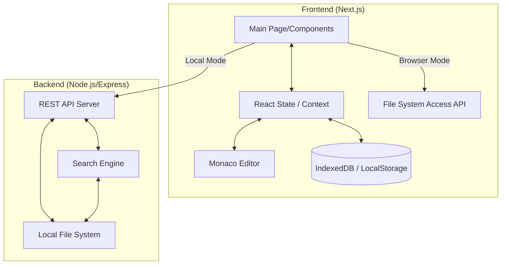

# [Architecture] Onrivi Author: 시스템 아키텍처 및 데이터 흐름 (v1.0)

## 1. 시스템 개요
Onrivi Author는 프론트엔드(Next.js)가 사용자 인터페이스와 편집 로직을 담당하고, 백엔드(Node.js)가 로컬 파일 시스템의 물리적 제어를 담당하는 **분산형 클라이언트-서버 구조**를 채택하고 있습니다. 또한, 브라우저 단독 실행(Browser Mode)을 위한 저장소 추상화 계층을 포함합니다.

## 2. 시스템 아키텍처 다이어그램

## 3. 핵심 구성 요소 명세

### 3.1 Frontend (Client-side)
*   **State Management (`page.tsx`):** `workspaceType`('local', 'browser')에 따라 데이터 소스를 결정하며, 현재 열린 파일(`currentFileNode`)과 콘텐츠를 중앙 제어합니다.
*   **Monaco Editor Integration:** 편집기의 실시간 변경 사항을 React 상태와 동기화하고, 툴바 명령을 에디터 인스턴스에 직접 전달합니다.
*   **Storage Abstraction (`helper.tsx`):** 로컬 파일 핸들을 `IndexedDB`에 저장하여 새로고침 후에도 권한 승인만으로 워크스페이스를 복구할 수 있게 설계되었습니다.

### 3.2 Backend (Server-side)
*   **API Server (`index.js`):** `D:\워크스페이스`를 루트로 하여 파일 CRUD를 수행합니다. 보안을 위해 지정된 경로 외부로의 접근은 차단됩니다.
*   **Global Search Engine:** 모든 마크다운 파일을 재귀적으로 스캔하여 메모리 내 검색을 수행하며, 검색어 위치를 포함한 스니펫을 생성하여 반환합니다.

## 4. 데이터 흐름 (Data Flow)

### 4.1 파일 열기 및 로드 흐름
1.  사용자가 탐색기(`FileTreeItem`)에서 파일 클릭.
2.  `openFile` 함수가 실행되며 현재 모드(`workspaceType`) 확인.
3.  **Local Mode:** 백엔드 `/api/file-content?path=...` 호출 → 파일 내용 수신.
4.  **Browser Mode:** 브라우저 파일 핸들(`FileSystemFileHandle`)로부터 직접 텍스트 추출.
5.  수신된 텍스트를 `Monaco Editor` 및 `React State`에 업데이트.

### 4.2 자동 저장 및 동기화 흐름
1.  에디터에서 텍스트 입력 시 `content` 상태 업데이트.
2.  `useEffect` 내의 **2초 디바운스(Debounce)** 타이머 작동.
3.  타이머 만료 시 `saveCurrentFile` 실행.
4.  현재 모드에 따라 백엔드 API 호출 또는 브라우저 파일 스트림에 쓰기 수행.
5.  상태 표시줄(StatusBar)에 저장 상태 반영.

### 4.3 전역 검색 흐름
1.  `GlobalSearch` 모달에서 검색어 입력.
2.  300ms 디바운스 후 백엔드 `/api/search?q=...` 호출.
3.  백엔드가 파일 본문을 스캔하여 일치하는 스니펫 리스트 반환.
4.  프론트엔드에서 결과 렌더링 → 결과 클릭 시 해당 경로로 `openFile` 호출.

### 4.4 다중 파일 병합 흐름
1.  사용자가 사이드바 또는 파일 목록에서 병합할 파일들을 다중 선택한 뒤 병합 도구를 켬 (`MergeModal`).
2.  모달에서 구분선(Separator) 형식, 원본 삭제 여부(`deleteSources`), 대상 파일명(`targetPath`)을 지정한 후 병합 실행.
3.  프론트엔드가 백엔드 `/api/merge-files` API를 호출.
4.  백엔드에서 각 원본 파일의 텍스트를 순차적으로 읽고 구분선/제목을 적용하여 대상 파일에 기록한 뒤, 옵션에 따라 원본 파일 삭제.
5.  성공 시 파일 목록 갱신(`refreshFileList`)을 트리거하고 병합 완료된 파일을 엶.

### 4.5 클립보드 이미지 직접 붙여넣기 및 물리 저장 흐름
1.  사용자가 Monaco Editor 영역에 이미지 파일을 복사/붙여넣기(Paste)하거나 드래그 앤 드롭(Drop)함.
2.  프론트엔드 이벤트 핸들러가 바이너리 데이터를 감지하여 Base64 인코딩 문자열로 획득.
3.  프론트엔드가 백엔드 `/api/upload-pasted-image` API를 호출.
4.  백엔드가 `WORKSPACE_ROOT/assets/` 폴더 내에 타임스탬프 기반 고유 파일명으로 이미지를 물리 저장.
5.  성공 시 마크다운 이미지 삽입 태그(``)를 에디터의 현재 커서 위치에 자동 주입.

### 4.6 내보내기 문서의 다운로드 폴더 자동 저장 흐름
1.  사용자가 `ExportModal`을 통해 마크다운 문서를 HTML/PDF/PNG 파일로 내보내기 실행.
2.  프론트엔드에서 클라이언트 라이브러리(`html2pdf`, `html-to-image` 등)를 통해 렌더링된 화면 컴포넌트의 가상 클론을 만들어 출력 포맷 파일(텍스트 또는 Base64)로 변환.
3.  프론트엔드가 백엔드 `/api/save-export` API를 호출.
4.  백엔드가 사용자의 시스템 홈 디렉토리 내 다운로드 폴더(`os.homedir()/Downloads`)에 즉시 물리적 파일로 저장하여 원클릭 다운로드 완료.

## 5. 인프라 및 배포 전략
*   **개발 환경:** `npm run dev`를 통해 프론트엔드(3000)와 백엔드(4000) 동시 실행.
*   **로컬 실행:** 백엔드가 로컬 서버 역할을 수행하므로, 사용자 PC에서 직접 서버를 구동하여 네이티브 앱처럼 활용 가능.

