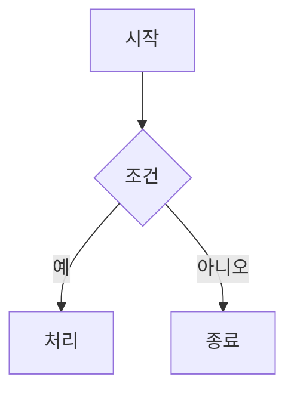

온리비 어서는 기술 문서 작성에 필수적인 다이어그램과 수식 렌더링을 지원합니다. [[시작하기로 가기]](/docs/help/00_시작하기.md)

## Mermaid 다이어그램

[Mermaid](https://mermaid.js.org/)를 사용하여 문서에 다양한 다이어그램을 삽입할 수 있습니다.

### 사용 방법
````markdown

````


### 지원 다이어그램 종류

| 종류              | 설명               |
| ----------------- | ------------------ |
| `graph`           | 순서도 (Flowchart) |
| `sequenceDiagram` | 시퀀스 다이어그램  |
| `classDiagram`    | 클래스 다이어그램  |
| `stateDiagram`    | 상태 다이어그램    |
| `gantt`           | 간트 차트          |
| `pie`             | 파이 차트          |
| `flowchart`       | 향상된 순서도      |
| `erDiagram`       | ER 다이어그램      |

### 렌더링 방식

Mermaid 코드 블록은 미리보기에서 실시간으로 SVG로 렌더링됩니다. 확대/축소에 무관하게 선명하게 표시됩니다.

## KaTeX 수식

[KaTeX](https://katex.org/)를 사용하여 수학 수식을 아름답게 렌더링할 수 있습니다.

### 인라인 수식

`$...$`로 감싸서 문장 내에 수식을 삽입합니다:

```
오일러 공식: $e^{i\pi} + 1 = 0$
```

### 블록 수식

`$$...$$`로 감싸서 별도 줄에 수식을 표시합니다:

```
$$
\int_{a}^{b} f(x) \, dx = F(b) - F(a)
$$
```

### 자주 사용하는 수식 예시

| 수식                    | 코드                      |
| ----------------------- | ------------------------- |
| $x^2$                   | `$x^2$`                   |
| $\sqrt{x}$              | `$\sqrt{x}$`              |
| $\frac{a}{b}$           | `$\frac{a}{b}$`           |
| $\sum_{i=1}^n$          | `$\sum_{i=1}^n$`          |
| $\alpha, \beta, \gamma$ | `$\alpha, \beta, \gamma$` |
| $\lim_{x \to 0}$        | `$\lim_{x \to 0}$`        |

### 주의사항

- KaTeX는 모든 LaTeX 명령어를 지원하지 않을 수 있습니다
- 지원 범위는 [KaTeX 공식 문서](https://katex.org/docs/supported.html)에서 확인할 수 있습니다
- 복잡한 수식은 렌더링 성능에 영향을 줄 수 있습니다

---

← [시작하기로 가기](/docs/help/00_시작하기.md)

