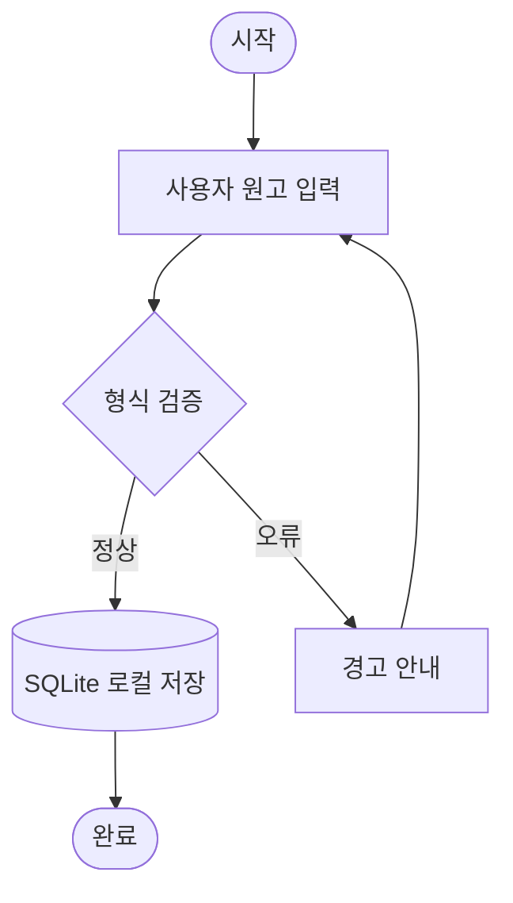
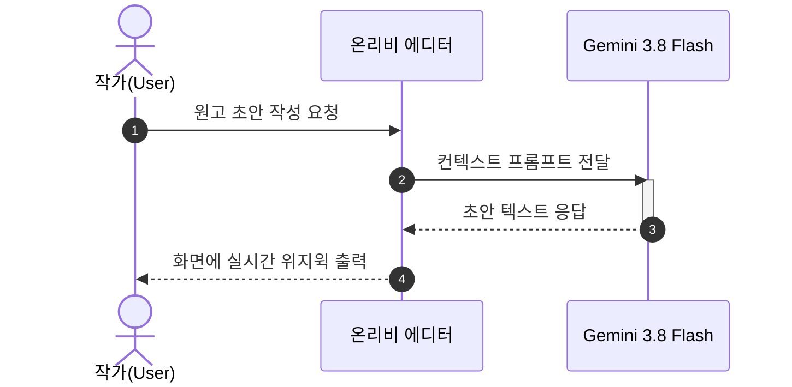
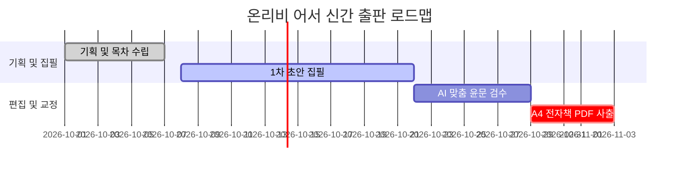
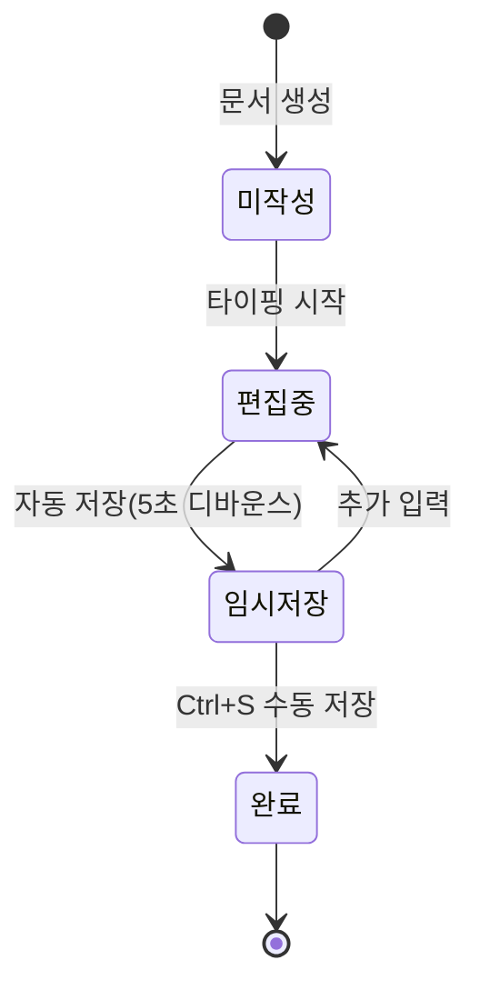

[◀ 이전: HELP-18 수학 수식 작성하기 (KaTeX)](/help/HELP-18_수학_수식_작성하기.md) | [📖 전체 목차](/help/00_시작하기.md) | [다음: HELP-20 각주(Footnote)와 주석 달기 ▶](/help/HELP-20_각주와_주석_달기.md)

> "발표 자료나 업무 매뉴얼을 만들 때, 파워포인트나 그래픽 툴을 켜서 마우스로 상자를 하나하나 그리고 화살표를 맞추느라 지친 적이 있으신가요? 글의 내용이 조금만 바뀌어도 그림을 처음부터 다시 그려야 하는 번거로움은 작가의 집필 집중력을 크게 떨어뜨립니다.  
> 온리비 어서(Onrivi Author)는 텍스트만으로 다이어그램을 코딩하는 세계적 표준 **Mermaid** 엔진을 기본 내장하고 있습니다. 간단한 텍스트 기호 몇 개만 입력하면, 전문 디자이너가 작업한 듯한 고품질 차트가 화면에 실시간 조판됩니다."

---

## 1. 코드 기반 다이어그램의 혁신과 기본 사용법

온리비 어서에서 다이어그램을 작성하는 방법은 매우 직관적입니다. 코드 블록 언어 태그에 `mermaid`를 지정하고, 원하는 구조를 텍스트로 적기만 하면 됩니다.

### ① 다이어그램 코드 블록 생성
- **마크다운 문법**: 백틱 3개(```) 뒤에 `mermaid`를 적고 블록을 구성합니다.
- **상단 서식 툴바**: 툴바의 **[차트]** 아이콘 클릭 시 기본 템플릿 코드 블록이 즉시 생성됩니다.
- **슬래시 명령어**: 에디터 본문에서 `/chart` 또는 `/mermaid` 입력 후 Enter

```markdown

```

위 코드를 입력하면 온리비 어서의 실시간 미리보기 화면에 깔끔한 디자인의 순서도 카드가 0.3초 만에 렌더링됩니다.

---

## 2. 대표 지원 다이어그램 4종 실전 문법 & 예시

온리비 어서는 업무 보고서, 기술 사양서, 출판 도서에서 가장 많이 활용되는 4대 다이어그램을 완벽히 지원합니다. 아래 실전문법을 복사하여 바로 테스트해보세요:

### ① 순서도 (Flowchart / Graph)
업무 절차, 시스템 로직, 의사결정 흐름을 시각화할 때 최적입니다.

- **흐름 방향**: `flowchart TD` (Top-Down, 위➔아래), `flowchart LR` (Left-Right, 좌➔우)
- **노드 모양**:
  - `[직사각형]`: 기본 프로세스 및 단계
  - `(둥근 모서리)`: 시작/종료 또는 유연한 작업
  - `([스타디움/캡슐])`: 핵심 단계
  - `{마름모}`: 분기 및 조건 판단
  - `[(원통/데이터베이스)]`: 저장소 및 DB
  - `((원형))`: 상태 지점

```markdown

```

### ② 시퀀스 다이어그램 (Sequence Diagram)
시스템 간의 메시지 흐름이나 등장인물 간의 시간 순서별 상호작용을 표현합니다.

- `autonumber`: 대화 순서 번호를 자동으로 매겨줍니다.
- `->>`: 실선 요청 화살표
- `-->>`: 점선 응답 화살표
- `activate` / `deactivate`: 작업 처리 구간 활성화

```markdown

```

### ③ 간트 차트 (Gantt Chart)
출판 프로젝트의 일정, 연구 개발 타임라인을 한눈에 조망할 수 있습니다.

```markdown

```

### ④ 클래스 및 상태 다이어그램 (Class & State Diagram)
객체 지향 소프트웨어 설계나 기계의 상태 전이를 명료하게 도식화합니다.

```markdown

```

---

## 3. 온리비 다이어그램 카드만의 4대 프리미엄 도구

온리비 어서의 다이어그램 렌더러는 단순한 이미지 표시기가 아닙니다. 각 다이어그램 블록 상단 헤더에 다음과 같은 전용 편의 도구가 내장되어 있습니다:

```
┌────────────────────────────────────────────────────────────────────────┐
│  📊 다이어그램 (Mermaid)          [코드 복사] [🔍 새 창으로 확대] [이미지 복사] [💾 저장] │
├────────────────────────────────────────────────────────────────────────┤
│                                                                        │
│                       [다이어그램 렌더링 화면]                           │
│                                                                        │
└────────────────────────────────────────────────────────────────────────┘
```

1. **[코드 복사] 버튼**:
   - 다이어그램의 마크다운 원본 코드를 즉시 클립보드에 복사하여 다른 문서나 깃허브에 공유할 수 있습니다.
2. **[이미지 복사] 버튼 (3배 고해상도 안티앨리어싱)**:
   - 일반 브라우저에서 캡처한 이미지는 글자가 깨지기 일쑤입니다. 온리비 어서는 화면 픽셀 비율의 **3배(300%) 초고해상도 캔버스**로 즉각 변환하여 클립보드에 기입합니다.
   - MS Word, 아래아한글(HWP), Slack, 카카오톡 등에 `Ctrl + V`로 붙여넣으면 인쇄물 수준의 선명한 그림이 들어갑니다.
3. **[💾 저장] 버튼**:
   - 다이어그램을 투명 배경의 깔끔한 고해상도 PNG 파일로 내 컴퓨터에 바로 저장합니다.
4. **스마트 자가 치유(Self-Healing) 파이프라인**:
   - 노드 명칭에 따옴표가 빠져 괄호(`()`, `[]`)나 특수기호가 충돌할 때, 온리비 내부 파서가 이를 전각 문자로 자동 치환하여 에러 발생을 사전 방어합니다.
   - 외부 웹페이지에서 복사해 올 때 유입되는 불필요한 유령 공백(NBSP)과 중첩 백틱 펜스를 0.1초 만에 자동 정제합니다.
   - 문법이 미완성되었을 때는 화면이 깨지지 않고 친절한 에러 상자와 함께 **[코드 원본 보기]** 버튼을 띄워 오류 위치를 즉시 교정할 수 있게 도와줍니다.

---

## 4. 온리비만의 독보적 특장점 — Mermaid 새 창 확대 줌 뷰어 (`mermaid:open-window`)

30개 이상의 단계로 구성된 대형 시스템 아키텍처나 전사 조직도는 에디터의 좁은 미리보기 폭 안에서 글자가 깨알처럼 작아져 읽기 어렵습니다. 온리비 어서는 이를 완벽히 해결하는 전용 확대 뷰어를 제공합니다.

### 🔍 새 창 확대 뷰어 실행 방법
- 다이어그램 상단 헤더의 **[🔍 새 창으로 확대]** 버튼 클릭!
- 또는 다이어그램 그래픽 영역을 **마우스로 더블클릭**!

### 🖥️ 데스크톱(Electron) 앱 네이티브 창
- 데스크톱 앱에서는 브라우저의 번거로운 팝업 차단 경고를 완전히 우회하는 **독립 BrowserWindow(`mermaid:open-window` IPC)**가 실행됩니다.
- 모니터 해상도에 맞추어 시원한 크기로 새 창이 활성화되며, **마우스 휠 줌(확대/축소)**과 자유로운 스크롤 이동을 통해 방대한 다이어그램도 나노 단위로 선명하게 정밀 열람할 수 있습니다.
- 듀얼 모니터 환경에서는 한쪽 화면에 에디터를 띄워두고, 다른 모니터에 확대 뷰어 창을 띄워놓은 채 설계와 글쓰기를 병행할 수 있어 압도적인 작업 편의성을 제공합니다.

---

## 5. 자주 묻는 질문 (FAQ)

### Q1. 노드 텍스트 안에 쉼표나 특수문자, 괄호를 그대로 넣고 싶어요.
**A.** 노드 텍스트를 큰따옴표(`"..."`)로 감싸주시면 파싱 충돌 없이 모든 특수문자를 자유롭게 기입할 수 있습니다:
```markdown
flowchart LR
    A["고객 데이터 (CRM/2026)"] --> B["결제 모듈 [PG 연동]"]
```

### Q2. 다크모드로 변경하면 다이어그램 색상도 자동으로 바뀌나요?
**A.** 네! 온리비 어서는 에디터의 다크모드/라이트모드 설정을 실시간으로 감지합니다. 테마가 전환되면 Mermaid의 배경색과 글자색 테마(`theme: dark` / `theme: default`)가 0.3초 만에 동기화되어 눈부심 없는 최적의 시각성을 유지합니다.

### Q3. PDF로 출판 내보내기를 할 때 다이어그램 크기가 페이지 밖으로 삐져나가지 않나요?
**A.** 온리비 어서의 조판 엔진은 모든 Mermaid 다이어그램을 반응형 벡터 SVG 규격으로 자동 래핑합니다. A4 용지 여백을 침범하지 않고 인쇄 페이지 폭에 맞추어 완벽한 비율로 자동 안착됩니다.

---

[◀ 이전: HELP-18 수학 수식 작성하기 (KaTeX)](/help/HELP-18_수학_수식_작성하기.md) | [📖 전체 목차](/help/00_시작하기.md) | [다음: HELP-20 각주(Footnote)와 주석 달기 ▶](/help/HELP-20_각주와_주석_달기.md)
