국세청 홈택스 설치프로그램 가이드

[ 목   차 ]

■ OS별 프로그램 설치&삭제 방법

1. Window

   1) 통합설치 프로그램 (VeraPort)

   2) 공인인증서 (MAGIC-PKI)

   3) 보고서 (REXPERT)

   4) 파일전송 (KUPLOAD)

   5) 전자서명 (MAGIC-XML)

   6) 부정접속차단 (IPINSIDE)

   7) 증명서 위변조 방지 (E-SAFER)

2. Fedora Linux

   1) 통합설치 프로그램 (VeraPort)

   2) 공인인증서 (MAGIC-PKI)

   3) 파일전송 (KUPLOAD)

   4) 전자서명 (MAGIC-XML)

   5) 부정접속차단 (IPINSIDE)

   6) 증명서 위변조 방지 (E-SAFER)

[ 목   차 ]

■ OS별 프로그램 설치&삭제 방법 (계속)

3. Ubuntu Linux

   1) 통합설치 프로그램 (VeraPort)

   2) 공인인증서 (MAGIC-PKI)

   3) 파일전송 (KUPLOAD)

   4) 전자서명 (MAGIC-XML)

   5) 부정접속차단 (IPINSIDE)

   6) 증명서 위변조 방지 (E-SAFER)

4. MAC

   1) 통합설치 프로그램 (VeraPort)

   2) 공인인증서 (MAGIC-PKI)

   3) 파일전송 (KUPLOAD)

   4) 전자서명 (MAGIC-XML)

   5) 부정접속차단 (IPINSIDE)

   6) 증명서 위변조 방지 (E-SAFER)

■ OS별 프로그램 설치&삭제 방법

1. Window

1-1) 통합설치프로그램(VERAPORT)

* 설치하기

자동설치

수동설치

1. 홈택스에서 아래와 같은 창이 뜨면 [확인]버튼을 눌러 설치화면으로 이동.

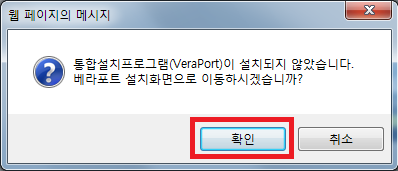

1. 홈택스 메인페이지 하단의 [통합설치프로그램] 메뉴 클릭.

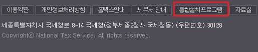

2. ① 설치화면에서 [통합설치프로그램 다운로드]

      버튼 클릭하여 프로그램 다운로드.

   ② 다운로드 완료되면 브라우저 하단의

      [실행]버튼 클릭하여 설치 프로그램 실행.

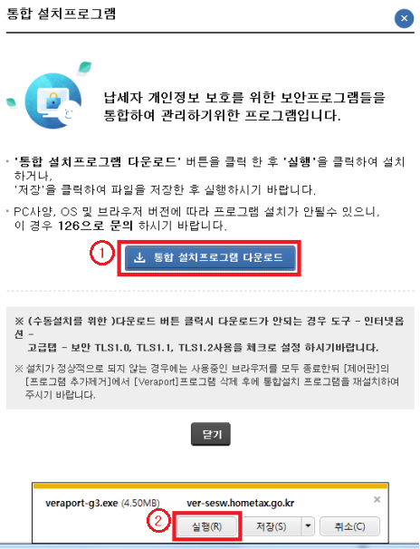

2. ① 보안프로그램 필수 탭의 통합설치프로그램           [다운로드]버튼 클릭.

   ② 브라우저 하단의 [실행]버튼 클릭.

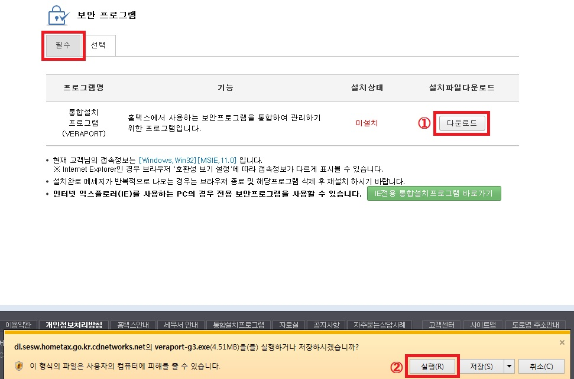

【참고】 다운로드 받은 설치파일을 실행하는 방법은 브라우저별로 다르므로 아래의 표시된 부분을 클릭해줘야 함.

    (크롬)                                  (파이어폭스)

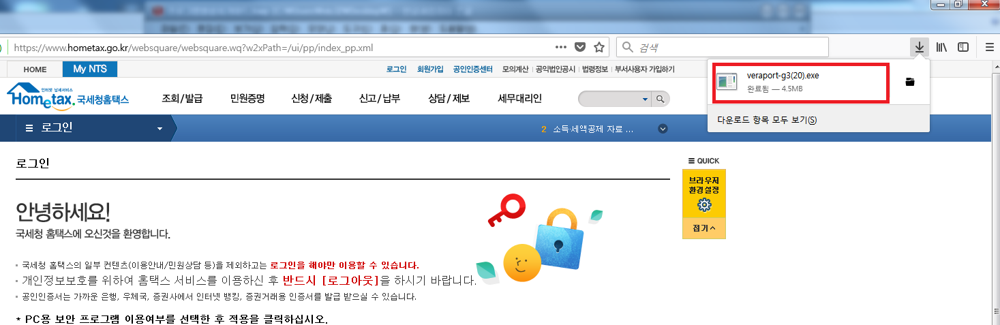

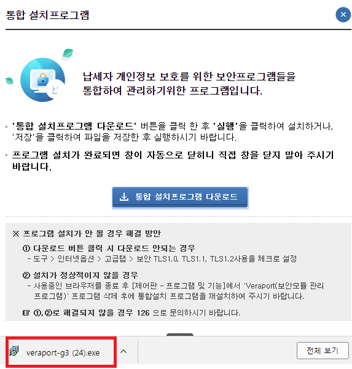

3. 설치 프로그램 창이 뜨면 [다음]버튼 클릭으로 설치를 진행하여 완료함.

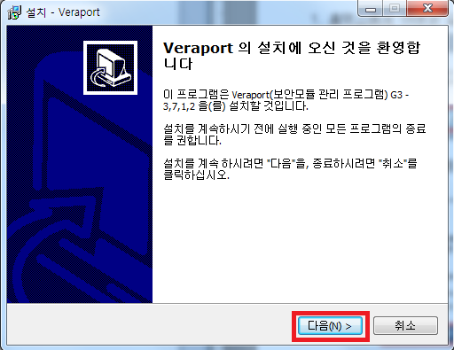

* 삭제하기

1. 컴퓨터 [제어판] - [프로그램 및 기능]에서

   【Veraport(보안모듈 관리 프로그램) G3 - 3,7,1,2】 더블클릭 또는 오른쪽버튼을 눌러 [제거]클릭.

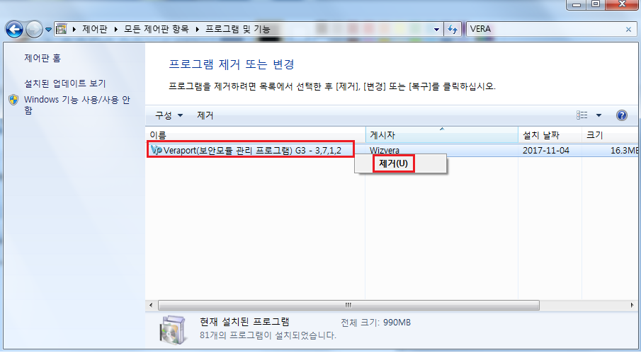

2. [예] 클릭하여 제거하고,

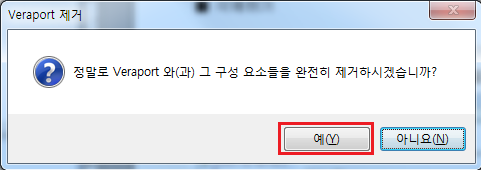

  제거완료 창이 뜨면 [확인]버튼 클릭.

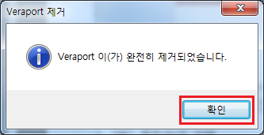

1-2) 공인인증서 (MAGIC-PKI)

   : 공인인증서 전자서명용 프로그램입니다.

* 설치하기

0. 통합설치프로그램(VeraPort)가 설치되어 있는 경우에는 해당 프로그램이 필요한 화면 접근 시 자동설치.

   수동으로 설치할 경우에는 아래 순서대로 설치 진행.

1. 홈택스 메인페이지 하단의 [통합설치프로그램] 메뉴 클릭.

2. 보안프로그램 선택 탭의 공인인증서(MAGIC-PKI) [설치하기] 버튼 클릭.

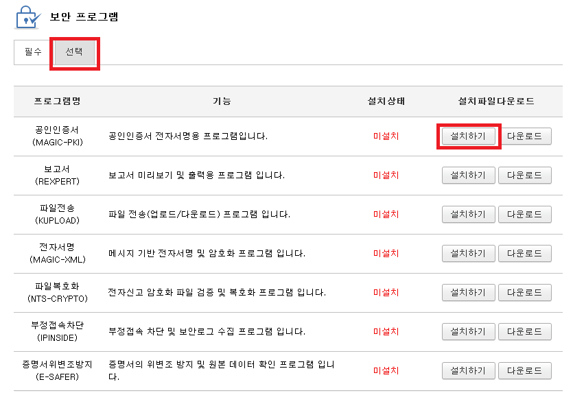

* 삭제하기

1. 컴퓨터 [제어판] - [프로그램 및 기능]에서

  【NTSMagicLineNP】 더블클릭 또는 오른쪽버튼을 눌러 [제거]클릭.

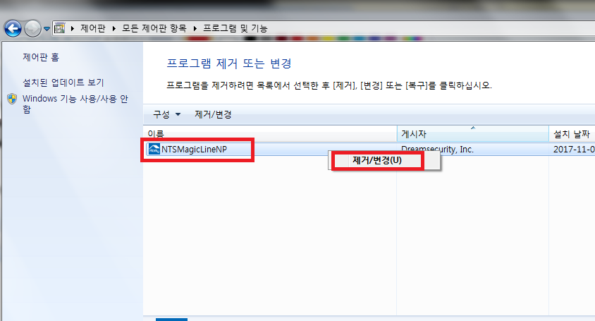

1-3) 보고서 (REXPERT)

   : 보고서 미리보기 및 출력용 프로그램 입니다.

* 설치하기

0. 통합설치프로그램(VeraPort)가 설치되어 있는 경우에는 해당 프로그램이 필요한 화면 접근 시 자동설치.

   수동으로 설치할 경우에는 아래 순서대로 설치 진행.

1. 홈택스 메인페이지 하단의 [통합설치프로그램] 메뉴 클릭.

2. 보안프로그램 선택 탭의 보고서(REXPERT) [설치하기] 버튼 클릭.

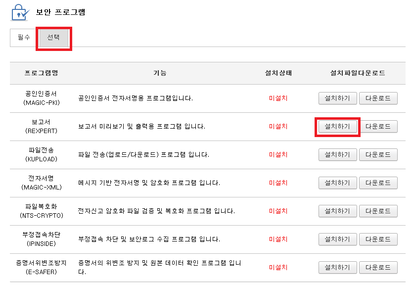

* 삭제하기

1. 컴퓨터 [제어판] - [프로그램 및 기능]에서

  【Rexpert30 Print Service 1,0,0,5】 더블클릭 또는 오른쪽버튼을 눌러 [제거]클릭.

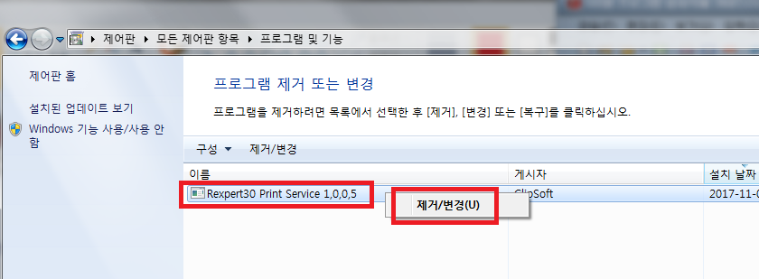

1-4) 파일전송 (KUPLOAD)

  : 파일 전송(업로드/다운로드) 프로그램 입니 다.

* 설치하기

0. 통합설치프로그램(VeraPort)가 설치되어 있는 경우에는 해당 프로그램이 필요한 화면 접근 시 자동설치.

   수동으로 설치할 경우에는 아래 순서대로 설치 진행.

1. 홈택스 메인페이지 하단의 [통합설치프로그램] 메뉴 클릭.

2. 보안프로그램 선택 탭의 파일전송(KUPLOAD) [설치하기] 버튼 클릭.

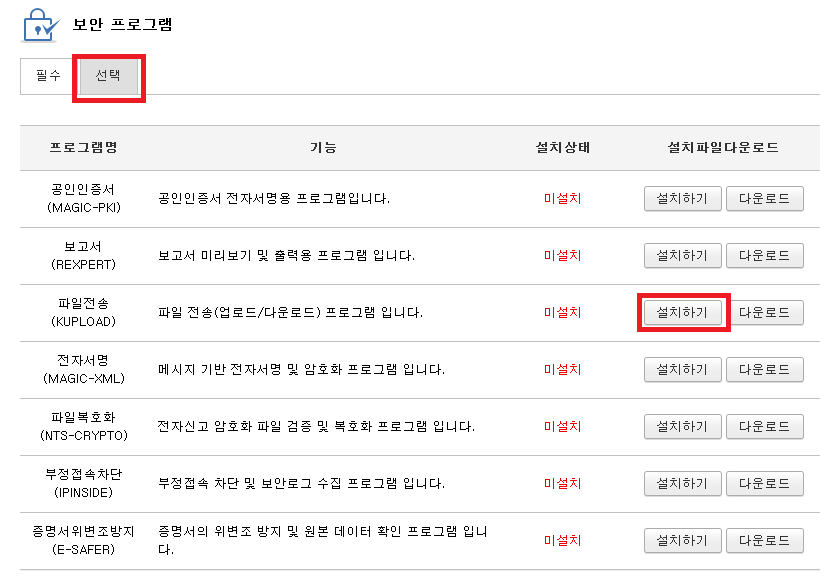

* 삭제하기

1. 컴퓨터 [제어판] - [프로그램 및 기능]에서

  【RAON K 2018】 더블클릭 또는 오른쪽버튼을 눌러 [제거]클릭.

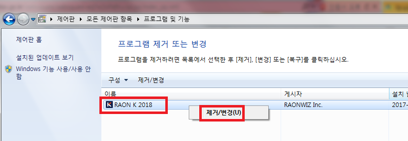

1-5) 전자서명 (MAGIC-XML)

  : 전자서명 프로그램 입니다.

* 설치하기

0. 통합설치프로그램(VeraPort)가 설치되어 있는 경우에는 해당 프로그램이 필요한 화면 접근 시 자동설치.

   수동으로 설치할 경우에는 아래 순서대로 설치 진행.

1. 홈택스 메인페이지 하단의 [통합설치프로그램] 메뉴 클릭.

2. 보안프로그램 선택 탭의 전자서명(MAGIC-XML) [설치하기] 버튼 클릭.

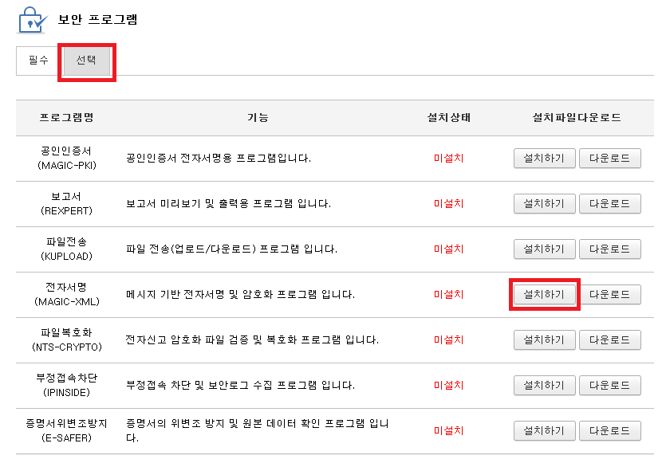

* 삭제하기

1. 컴퓨터 [제어판] - [프로그램 및 기능]에서

  【NTSMagicXMLSecurityNP】 더블클릭 또는 오른쪽버튼을 눌러 [제거]클릭.

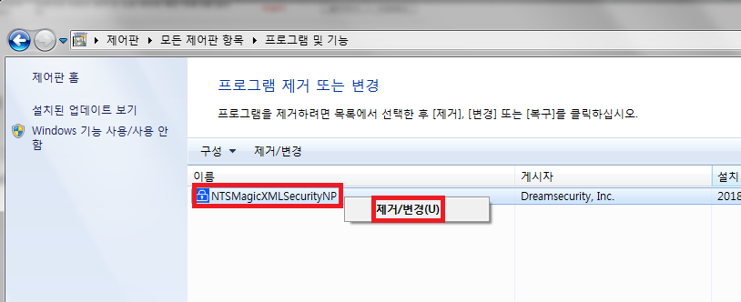

1-6) 부정접속차단 (IPINSIDE)

  : 부정접속 차단 관련 프로그램 입니다.

* 설치하기

0. 통합설치프로그램(VeraPort)가 설치되어 있는 경우에는 해당 프로그램이 필요한 화면 접근 시 자동설치.

   수동으로 설치할 경우에는 아래 순서대로 설치 진행.

1. 홈택스 메인페이지 하단의 [통합설치프로그램] 메뉴 클릭.

2. 보안프로그램 선택 탭의 부정접속차단(IPINSIDE) [설치하기] 버튼 클릭.

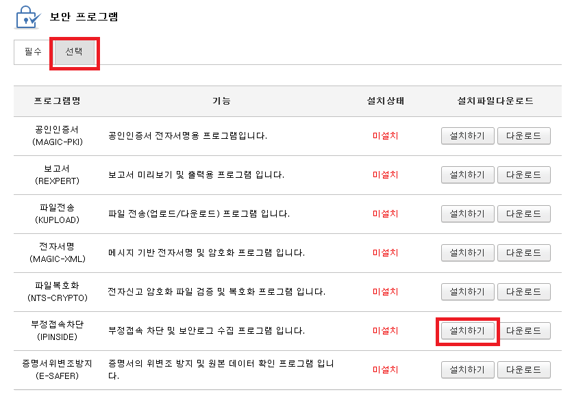

* 삭제하기

1. 컴퓨터 [제어판] - [프로그램 및 기능]에서

  【IPinside LWS Agent】 더블클릭 또는 오른쪽버튼을 눌러 [제거]클릭.

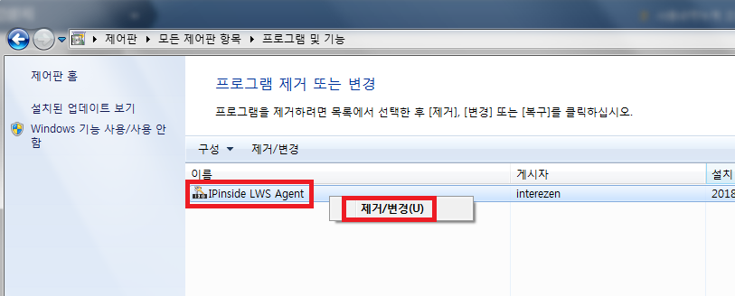

1-7) 증명서 위변조 방지 (E-SAFER)

  : 민원증명 발급 시 사용하는 프로그램 입니다.

* 설치하기

0. 통합설치프로그램(VeraPort)가 설치되어 있는 경우에는 해당 프로그램이 필요한 화면 접근 시 자동설치.

   수동으로 설치할 경우에는 아래 순서대로 설치 진행.

1. 홈택스 메인페이지 하단의 [통합설치프로그램] 메뉴 클릭.

2. 보안프로그램 선택 탭의 증명서위변조방지(E-SAFER) [설치하기] 버튼 클릭.

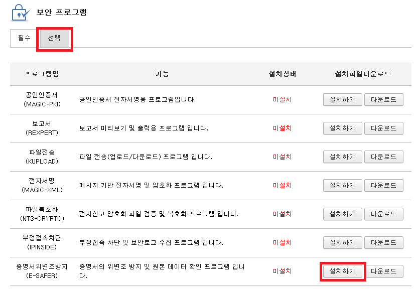

* 삭제하기

1. 컴퓨터 [제어판] - [프로그램 및 기능]에서

  【MarkAny Inc. e-PageSafer v2.5 NTS NOAX Rex】 더블클릭 또는 오른쪽버튼을 눌러 [제거]클릭.

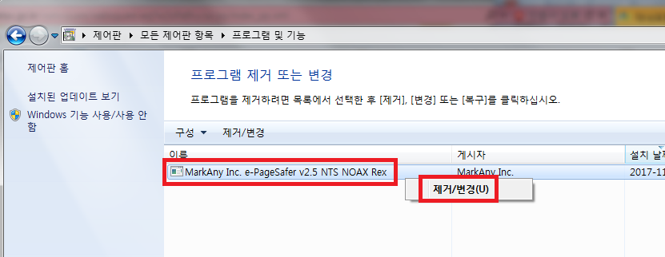

2. Fedora Linux

2-1) 통합설치 프로그램 (VERAPORT)

* 설치하기

자동설치

1. 홈택스에서 아래와 같은 창이 뜨면 [확인]버튼을 눌러 설치화면으로 이동.

2. ① 설치화면에서 [통합설치프로그램 다운로드]

      버튼 클릭하여 프로그램 다운로드.

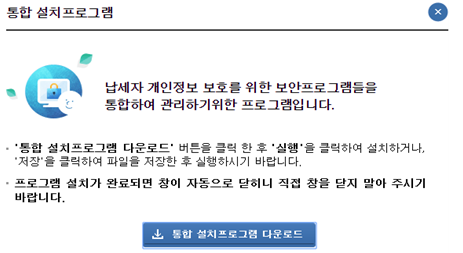

※ 64bit 설치파일 : veraport-g3.x86_64.rpm

※ 32bit 설치파일 : veraport-g3.i386.rpm

   ② 다운로드 완료 되면 [열기]->[확인] 버튼을

      클릭하여 설치 프로그램 실행

3. ① 프로그램설치 화면에서 [설치] 클릭

   ※ 인증창이 나오면 관리자 패스워드 입력

   ② 설치 완료 후 [실행] 클릭

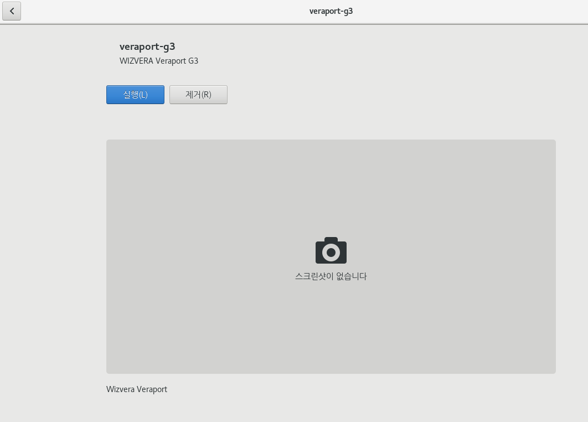

4. 프로세스 구동 확인

※ 프로세스가 구동되어 있지 않으면 베라포트 설치가 계속 유도 될 수 있음

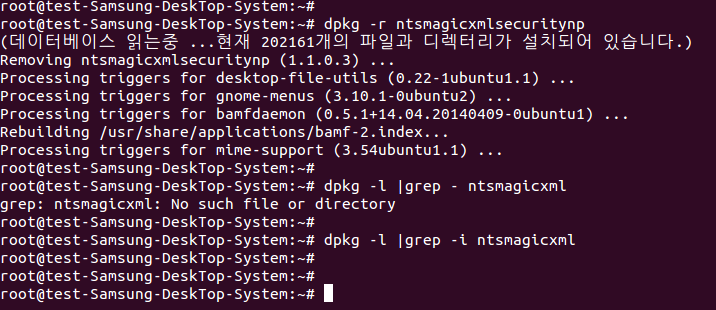

수동설치

1. 홈택스 메인페이지 하단의 [통합설치프로그램] 메뉴 클릭.

2. ① 보안프로그램 필수 탭의 통합설치프로그램 [다운로드]버튼 클릭.

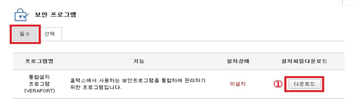

   ② 터미널에서 커맨드로 설치 진행

   ]# rpm –ivh veraport-g3.x86_64.rpm (64bit)

   ]# rpm –ivh veraport-g3.i386.rpm (32bit)
   ※ 해당 파일이 있는 위치에서 vera(탭) 키를 누르면 자동 완성 됨

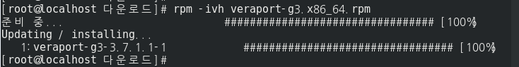

   ③ 설치 확인

   ]# rpm –qa |grep veraport

  ※ 아무것도 출력되지 않으면 설치되지 않은 것임

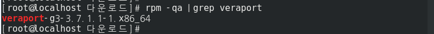

   ④ 서비스 동작 확인

   ]# ps –ef |grep veraport

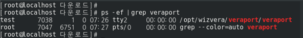

  ※ 구동되어 있지 않은 경우 [파일] -> /opt/wizvera/veraport/veraport 를 찾아 더블클릭으로 실행

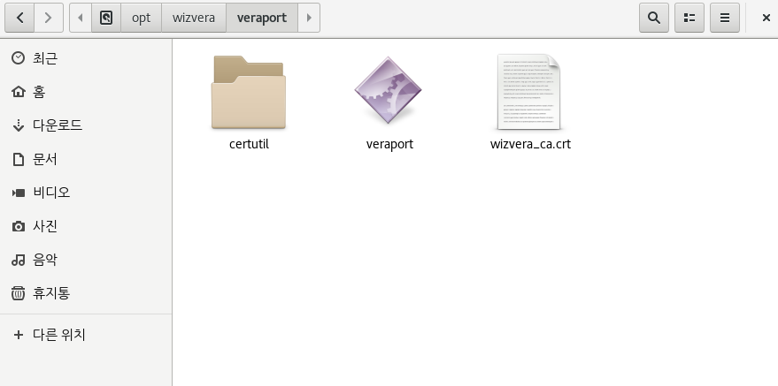

* 삭제하기

   ※ 패키지명을 정확히 써줘야 삭제가 진행 됨

종류

설치 패키지명

통합설치

베라포트, 위즈베라

veraport-g3

   ]# rpm –e veraport-g3 
   ※ veraport: no process found 메시지 뜨지 않고 완료되어도 정상 삭제 됨

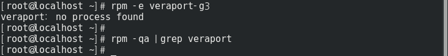

2-2) 공인인증서 (MAGIC-PKI)

   : 공인인증서 전자서명용 프로그램입니다.

* 설치하기

0. 통합설치프로그램(VeraPort)가 설치되어 있는 경우에는 해당 프로그램이 필요한 화면 접근 시 자동설치.

   수동으로 설치할 경우에는 아래 순서대로 설치 진행.

1. 홈택스 메인페이지 하단의 [통합설치프로그램] 메뉴 클릭.

2. 보안프로그램 선택 탭의 공인인증서(MAGIC-PKI) [설치하기] 버튼 클릭.

※ 인증창이 나오면 관리자 패스워드 입력

3. 설치 확인

   ]# rpm –qa |grep ntsmagiclinenp

  ※ 아무것도 출력되지 않으면 설치되지 않은 것임

* 삭제하기

   ※ 패키지명을 정확히 써줘야 삭제가 진행 됨

종류

설치 패키지명

공인인증서

PKI툴킷, 드림시큐리티

ntsmagiclinenp

   ]# rpm –e ntsmagiclinenp

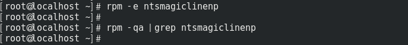

2-3) 파일전송 (KUPLOAD)

  : 파일 전송(업로드/다운로드) 프로그램 입니 다.

* 설치하기

0. 통합설치프로그램(VeraPort)가 설치되어 있는 경우에는 해당 프로그램이 필요한 화면 접근 시 자동설치.

   수동으로 설치할 경우에는 아래 순서대로 설치 진행.

1. 홈택스 메인페이지 하단의 [통합설치프로그램] 메뉴 클릭.

2. 보안프로그램 선택 탭의 파일전송(KUPLOAD) [설치하기] 버튼 클릭.

※ 인증창이 나오면 관리자 패스워드 입력

3. 설치 확인

   ]# rpm –qa |grep raonk-2018

  ※ 아무것도 출력되지 않으면 설치되지 않은 것임

* 삭제하기

   ※ 패키지명을 정확히 써줘야 삭제가 진행 됨

종류

설치 패키지명

파일업로드

Raon K upload, 라온위즈

raonk-2018

   ]# rpm –e raonk-2018

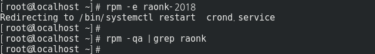

2-4) 전자서명 (MAGIC-XML)

  : 전자서명 프로그램 입니다.

* 설치하기

0. 통합설치프로그램(VeraPort)가 설치되어 있는 경우에는 해당 프로그램이 필요한 화면 접근 시 자동설치.

   수동으로 설치할 경우에는 아래 순서대로 설치 진행.

1. 홈택스 메인페이지 하단의 [통합설치프로그램] 메뉴 클릭.

2. 보안프로그램 선택 탭의 전자서명(MAGIC-XML) [설치하기] 버튼 클릭.

※ 인증창이 나오면 관리자 패스워드 입력

3. 설치 확인

   ]# rpm –qa |grep ntsmagicxmlsecuritynp

  ※ 아무것도 출력되지 않으면 설치되지 않은 것임

* 삭제하기

   ※ 패키지명을 정확히 써줘야 삭제가 진행 됨

종류

설치 패키지명

XML전자서명

XML전자서명, 드림시큐리티

ntsmagicxmlsecuritynp

   ]# rpm –e ntsmagicxmlsecuritynp

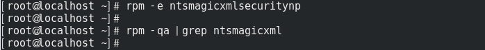

2-5) 부정접속차단 (IPINSIDE)

  : 부정접속 차단 관련 프로그램 입니다.

* 설치하기

0. 통합설치프로그램(VeraPort)가 설치되어 있는 경우에는 해당 프로그램이 필요한 화면 접근 시 자동설치.

   수동으로 설치할 경우에는 아래 순서대로 설치 진행.

1. 홈택스 메인페이지 하단의 [통합설치프로그램] 메뉴 클릭.

2. 보안프로그램 선택 탭의 부정접속차단(IPINSIDE) [설치하기] 버튼 클릭.

※ 인증창이 나오면 관리자 패스워드 입력

3. 설치 확인

   ]# rpm –qa |grep ipinside

  ※ 아무것도 출력되지 않으면 설치되지 않은 것임

* 삭제하기

   ※ 패키지명을 정확히 써줘야 삭제가 진행 됨

종류

설치 패키지명

접속단말정보수집

IPINSIDE, 인터리젠

ipinside-lws

   ]# rpm –e ipinside-lws

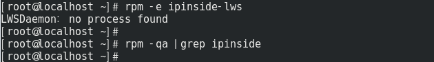

2-6) 증명서 위변조 방지 (E-SAFER)

  : 민원증명 발급 시 사용하는 프로그램 입니다.

* 설치하기

0. 통합설치프로그램(VeraPort)가 설치되어 있는 경우에는 해당 프로그램이 필요한 화면 접근 시 자동설치.

   수동으로 설치할 경우에는 아래 순서대로 설치 진행.

1. 홈택스 메인페이지 하단의 [통합설치프로그램] 메뉴 클릭.

2. 보안프로그램 선택 탭의 증명서위변조방지(E-SAFER) [설치하기] 버튼 클릭.

※ 인증창이 나오면 관리자 패스워드 입력

2. 설치 확인

   ]# rpm –qa |grep mdmview

  ※ 아무것도 출력되지 않으면 설치되지 않은 것임

* 삭제하기

   ※ 패키지명을 정확히 써줘야 삭제가 진행 됨

종류

설치 패키지명

전자문서위변조방지

e-Safer, 마크애니

mdmviewer-markany

   ]# rpm –e mdmviewer-markany

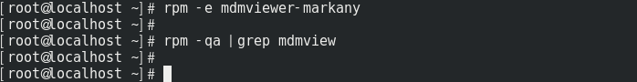

3. Ubuntu Linux

3-1) 통합설치 프로그램 (VERAPORT)

* 설치하기

자동설치

1. 홈택스에서 아래와 같은 창이 뜨면 [확인]버튼을 눌러 설치화면으로 이동.

2. ① 설치화면에서 [통합설치프로그램 다운로드]

      버튼 클릭하여 프로그램 다운로드.

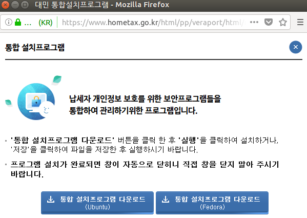

※ 64bit 설치파일 : veraport-g3.x86_64.deb

※ 32bit 설치파일 : veraport-g3.i386.deb

   ② 다운로드 완료 되면 [열기]->[확인] 버튼을

      클릭하여 설치 프로그램 실행

3. ① 프로그램설치 화면에서 [install] 클릭

   ※ 인증창이 나오면 관리자 패스워드 입력

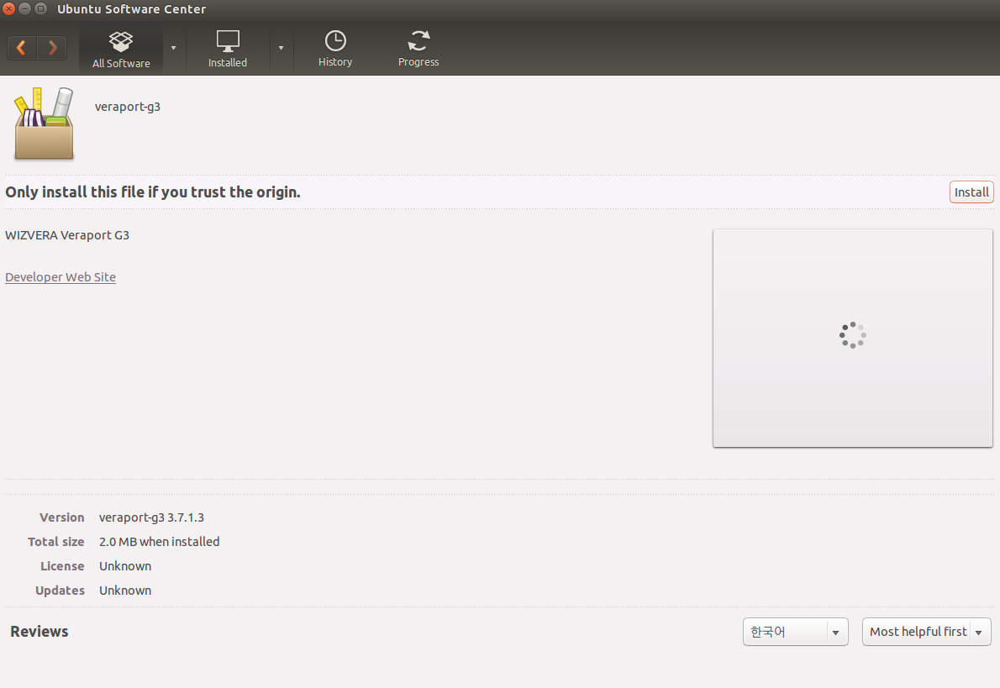

   ② [파일]-> /opt/wizvera/veraport/veraport 를

   찾아 더블클릭으로 실행

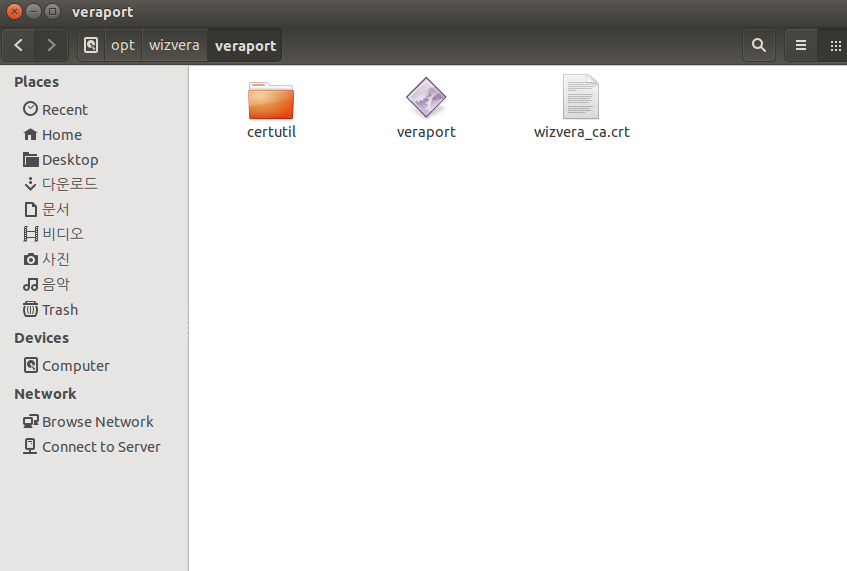

4. 프로세스 구동 확인

※ 프로세스가 구동되어 있지 않으면 베라포트 설치가 계속 유도 될 수 있음

수동설치

1. 홈택스 메인페이지 하단의 [통합설치프로그램] 메뉴 클릭.

2. ① 보안프로그램 필수 탭의 통합설치프로그램 [다운로드]버튼 클릭.

   ② 터미널에서 커맨드로 설치 진행

   ]# dpkg –i veraport-g3_amd64.deb (64bit)

   ]# rpm –ivh veraport-g3_i386.deb (32bit)
   ※ 해당 파일이 있는 위치에서 vera(탭) 키를 누르면 자동 완성 됨

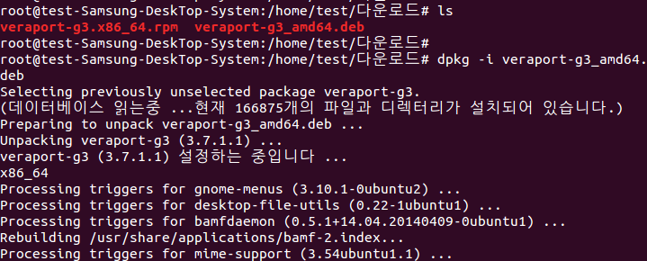

   ③ 설치 확인

   ]# dpkg –l |grep veraport

  ※ 아무것도 출력되지 않으면 설치되지 않은 것임

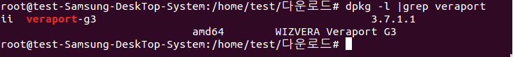

   ④ 서비스 동작 확인

   ]# ps –ef |grep veraport

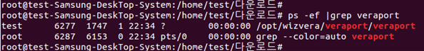

  ※ 구동되어 있지 않은 경우 [파일] -> /opt/wizvera/veraport/veraport 를 찾아 더블클릭으로 실행

* 삭제하기

   ※ 패키지명을 정확히 써줘야 삭제가 진행 됨

종류

설치 패키지명

통합설치

베라포트, 위즈베라

veraport-g3

   ]# dpkg –r veraport-g3

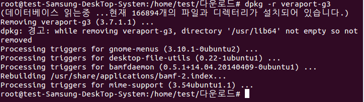

3-2) 공인인증서 (MAGIC-PKI)

   : 공인인증서 전자서명용 프로그램입니다.

* 설치하기

0. 통합설치프로그램(VeraPort)가 설치되어 있는 경우에는 해당 프로그램이 필요한 화면 접근 시 자동설치.

   수동으로 설치할 경우에는 아래 순서대로 설치 진행.

1. 홈택스 메인페이지 하단의 [통합설치프로그램] 메뉴 클릭.

2. 보안프로그램 선택 탭의 공인인증서(MAGIC-PKI) [설치하기] 버튼 클릭.

※ 인증창이 나오면 관리자 패스워드 입력

3. 설치 확인

   ]# dpkg -l |grep –i ntsmagiclinenp

  ※ 아무것도 출력되지 않으면 설치되지 않은 것임

* 삭제하기

   ※ 패키지명을 정확히 써줘야 삭제가 진행 됨

종류

설치 패키지명

공인인증서

PKI툴킷, 드림시큐리티

ntsmagiclinenp

   ]# dpkg -r ntsmagiclinenp

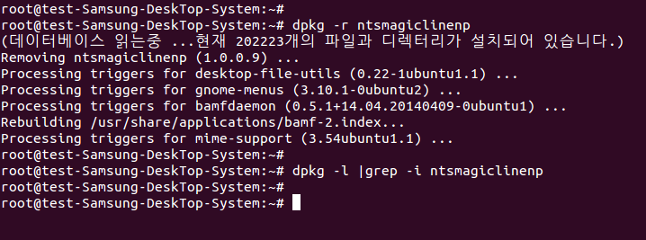

3-3) 파일전송 (KUPLOAD)

  : 파일 전송(업로드/다운로드) 프로그램 입니다.

* 설치하기

0. 통합설치프로그램(VeraPort)가 설치되어 있는 경우에는 해당 프로그램이 필요한 화면 접근 시 자동설치.

   수동으로 설치할 경우에는 아래 순서대로 설치 진행.

1. 홈택스 메인페이지 하단의 [통합설치프로그램] 메뉴 클릭.

2. 보안프로그램 선택 탭의 파일전송(KUPLOAD) [설치하기] 버튼 클릭.

※ 인증창이 나오면 관리자 패스워드 입력

3. 설치 확인

  ]# dpkg -l |grep –i raonk

  ※ 아무것도 출력되지 않으면 설치되지 않은 것임

* 삭제하기

   ※ 패키지명을 정확히 써줘야 삭제가 진행 됨

종류

설치 패키지명

파일업로드

Raon K upload, 라온위즈

raonk-2018

   ]# dpkg –r raonk-2018

   
3-4) 전자서명 (MAGIC-XML)

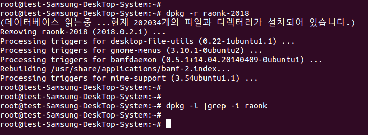

  : 전자서명 프로그램 입니다.

* 설치하기

0. 통합설치프로그램(VeraPort)가 설치되어 있는 경우에는 해당 프로그램이 필요한 화면 접근 시 자동설치.

   수동으로 설치할 경우에는 아래 순서대로 설치 진행.

1. 홈택스 메인페이지 하단의 [통합설치프로그램] 메뉴 클릭.

2. 보안프로그램 선택 탭의 전자서명(MAGIC-XML) [설치하기] 버튼 클릭.

※ 인증창이 나오면 관리자 패스워드 입력

3. 설치 확인

  ]# dpkg -l |grep –i ntsmagicxml

  ※ 아무것도 출력되지 않으면 설치되지 않은 것임

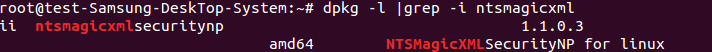

* 삭제하기

   ※ 패키지명을 정확히 써줘야 삭제가 진행 됨

종류

설치 패키지명

XML전자서명

XML전자서명, 드림시큐리티

ntsmagicxmlsecuritynp

   ]# dpkg -r ntsmagicxmlsecuritynp

3-5) 부정접속차단 (IPINSIDE)

  : 부정접속 차단 관련 프로그램 입니다.

* 설치하기

0. 통합설치프로그램(VeraPort)가 설치되어 있는 경우에는 해당 프로그램이 필요한 화면 접근 시 자동설치.

   수동으로 설치할 경우에는 아래 순서대로 설치 진행.

1. 홈택스 메인페이지 하단의 [통합설치프로그램] 메뉴 클릭.

2. 보안프로그램 선택 탭의 부정접속차단(IPINSIDE) [설치하기] 버튼 클릭.

※ 인증창이 나오면 관리자 패스워드 입력

3. 설치 확인

  ]# dpkg -l |grep –i ipinside

  ※ 아무것도 출력되지 않으면 설치되지 않은 것임

* 삭제하기

   ※ 패키지명을 정확히 써줘야 삭제가 진행 됨

종류

설치 패키지명

접속단말정보수집

IPINSIDE, 인터리젠

ipinside-lws

   ]# dpkg -r ipinside-lws

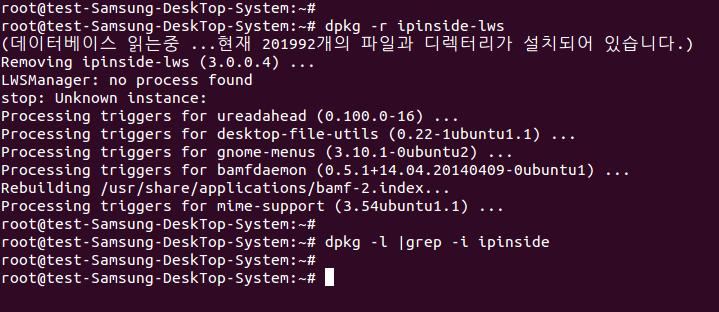

3-6) 증명서 위변조 방지 (E-SAFER)

  : 민원증명 발급 시 사용하는 프로그램 입니다.

* 설치하기

0. 통합설치프로그램(VeraPort)가 설치되어 있는 경우에는 해당 프로그램이 필요한 화면 접근 시 자동설치.

   수동으로 설치할 경우에는 아래 순서대로 설치 진행.

1. 홈택스 메인페이지 하단의 [통합설치프로그램] 메뉴 클릭.

2. 보안프로그램 선택 탭의 증명서위변조방지(E-SAFER) [설치하기] 버튼 클릭.

※ 인증창이 나오면 관리자 패스워드 입력

2. 설치 확인

  ]# dpkg -l |grep –i mdmview

  ※ 아무것도 출력되지 않으면 설치되지 않은 것임

* 삭제하기

   ※ 패키지명을 정확히 써줘야 삭제가 진행 됨

종류

설치 패키지명

전자문서위변조방지

e-Safer, 마크애니

mdmviewer-markany

   ]# dpkg –r mdmviewer-markany

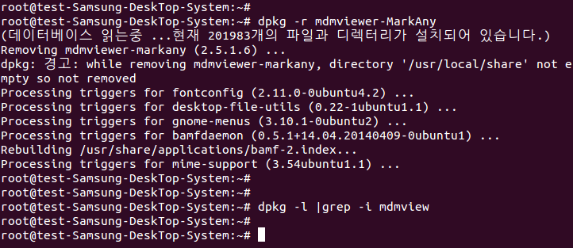

4. MAC

4-1) 통합설치프로그램(VERAPORT)

* 설치하기

자동설치

수동설치

1. 홈택스에서 아래와 같은 창이 뜨면 [확인]버튼을 눌러 설치화면으로 이동.

1. 홈택스 메인페이지 하단의 [통합설치프로그램] 메뉴 클릭.

2. ① 설치화면에서 [통합설치프로그램 다운로드]

      버튼 클릭하여 프로그램 다운로드.

   ② 다운로드 완료되면 Finder -> 즐겨찾기 ->

      다운로드에서 다운 된 패키지를 더블클릭하여

      설치 프로그램 실행.

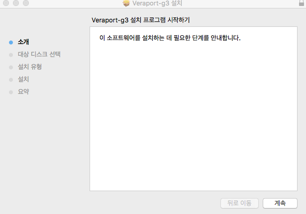

2. ① 보안프로그램 필수 탭의 통합설치프로그램           [다운로드]버튼 클릭.

  ② 다운로드 완료되면 Finder -> 즐겨찾기 ->

      다운로드에서 다운 된 패키지를 더블클릭하여

      설치 프로그램 실행.

* 설치 확인

- 열린 Finder 메뉴 중 즐겨찾기 -> 응용프로그램에서 설치 된 패키지 확인

* 삭제하기

- 열린 Finder 메뉴 중 즐겨찾기 -> 응용프로그램에서 설치 된 패키지 확인 -> 더블클릭 -> uninstaller

   ->

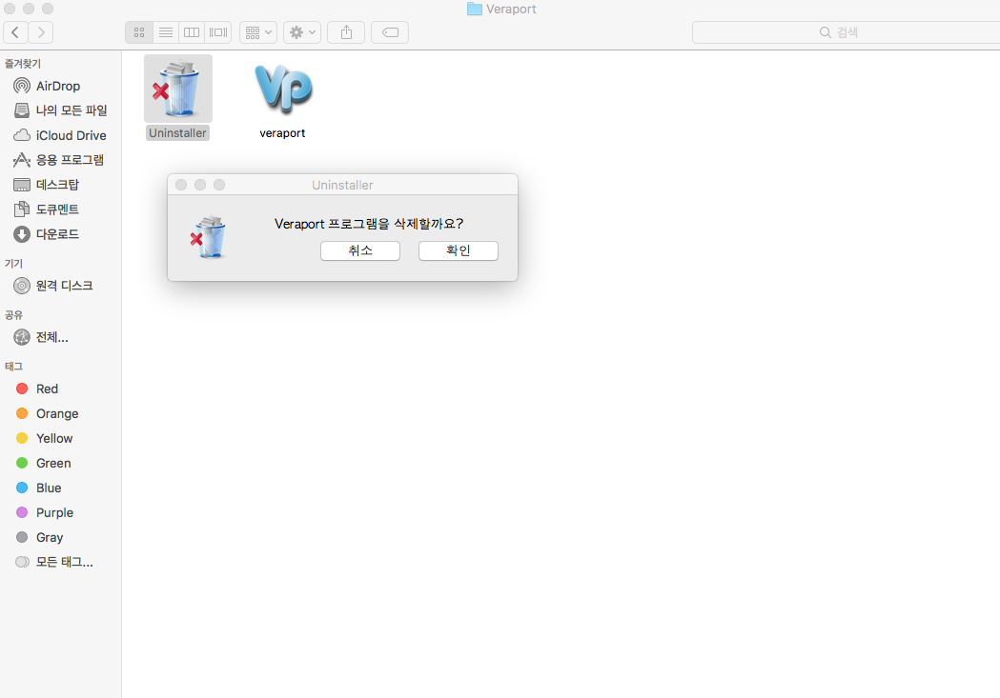

4-2) 공인인증서 (MAGIC-PKI)

   : 공인인증서 전자서명용 프로그램입니다.

* 설치하기

0. 통합설치프로그램(VeraPort)가 설치되어 있는 경우에는 해당 프로그램이 필요한 화면 접근 시 자동설치.

   수동으로 설치할 경우에는 아래 순서대로 설치 진행.

1. 홈택스 메인페이지 하단의 [통합설치프로그램] 메뉴 클릭.

2. 보안프로그램 선택 탭의 공인인증서(MAGIC-PKI) [설치하기] 버튼 클릭.

※ 인증창이 나오면 관리자 패스워드 입력

* 삭제하기

- 열린 Finder 메뉴 중 즐겨찾기 -> 응용프로그램에서 설치 된 패키지 확인 -> 우클릭 -> 휴지통으로 이동

※ 항목이 열려있기 때문에 휴지통으로 이동할 수 없습니다“ 라는 메세지와 함께 패키지가 삭제되지 않으면

   [활성상태보기]->우클릭->[종료] 를 클릭해서 활성화 되어있는 프로세스 종료 후 삭제

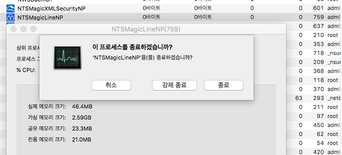

                        [ 활성화 된 프로세스 종료 ]                       
4-3) 파일전송 (KUPLOAD)

  : 파일 전송(업로드/다운로드) 프로그램 입니 다.

* 설치하기

0. 통합설치프로그램(VeraPort)가 설치되어 있는 경우에는 해당 프로그램이 필요한 화면 접근 시 자동설치.

   수동으로 설치할 경우에는 아래 순서대로 설치 진행.

1. 홈택스 메인페이지 하단의 [통합설치프로그램] 메뉴 클릭.

2. 보안프로그램 선택 탭의 파일전송(KUPLOAD) [설치하기] 버튼 클릭.

※ 인증창이 나오면 관리자 패스워드 입력

* 삭제하기

- 열린 Finder 메뉴 중 즐겨찾기 -> 응용프로그램에서 설치 된 패키지 확인 -> 우클릭 -> 휴지통으로 이동

4-4) 전자서명 (MAGIC-XML)

  : 전자서명 프로그램 입니다.

* 설치하기

0. 통합설치프로그램(VeraPort)가 설치되어 있는 경우에는 해당 프로그램이 필요한 화면 접근 시 자동설치.

   수동으로 설치할 경우에는 아래 순서대로 설치 진행.

1. 홈택스 메인페이지 하단의 [통합설치프로그램] 메뉴 클릭.

2. 보안프로그램 선택 탭의 전자서명(MAGIC-XML) [설치하기] 버튼 클릭.

※ 인증창이 나오면 관리자 패스워드 입력

* 삭제하기

- 열린 Finder 메뉴 중 즐겨찾기 -> 응용프로그램에서 설치 된 패키지 확인 -> 우클릭 -> 휴지통으로 이동

※ 항목이 열려있기 때문에 휴지통으로 이동할 수 없습니다“ 라는 메세지와 함께 패키지가 삭제되지 않으면

   [활성상태보기]->우클릭->[종료] 를 클릭해서 활성화 되어있는 프로세스 종료 후 삭제

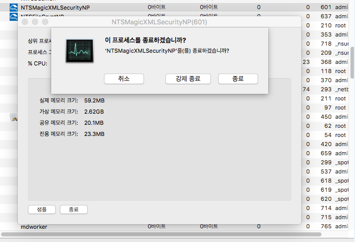

                   [ 활성화 된 프로세스 종료 ]

4-5) 부정접속차단 (IPINSIDE)

  : 부정접속 차단 관련 프로그램 입니다.

* 설치하기

0. 통합설치프로그램(VeraPort)가 설치되어 있는 경우에는 해당 프로그램이 필요한 화면 접근 시 자동설치.

   수동으로 설치할 경우에는 아래 순서대로 설치 진행.

1. 홈택스 메인페이지 하단의 [통합설치프로그램] 메뉴 클릭.

2. 보안프로그램 선택 탭의 부정접속차단(IPINSIDE) [설치하기] 버튼 클릭.

※ 인증창이 나오면 관리자 패스워드 입력

* 삭제하기

- 열린 Finder 메뉴 중 즐겨찾기 -> 응용프로그램에서 설치 된 패키지 확인 -> 우클릭 -> 휴지통으로 이동

4-6) 증명서 위변조 방지 (E-SAFER)

  : 민원증명 발급 시 사용하는 프로그램 입니다.

* 설치하기

0. 통합설치프로그램(VeraPort)가 설치되어 있는 경우에는 해당 프로그램이 필요한 화면 접근 시 자동설치.

   수동으로 설치할 경우에는 아래 순서대로 설치 진행.

1. 홈택스 메인페이지 하단의 [통합설치프로그램] 메뉴 클릭.

2. 보안프로그램 선택 탭의 증명서위변조방지(E-SAFER) [설치하기] 버튼 클릭.

※ 인증창이 나오면 관리자 패스워드 입력

* 삭제하기

- 열린 Finder 메뉴 중 즐겨찾기 -> 응용프로그램에서 설치 된 패키지 확인 -> 우클릭 -> 휴지통으로 이동

홈택스 프로그램 삭제하기

컴퓨터 [제어판] - [프로그램 및 기능]에서 아래의 프로그램 목록을 참고하여

삭제할 프로그램을 더블클릭 또는 오른쪽 버튼을 눌러 [제거] 클릭.

프로그램명

[제어판]-[프로그램및기능]에서 삭제

통합설치 프로그램 (VERAPORT)

: Veraport(보안모듈 관리 프로그램) G3 - 3,7,3,4

공인인증서 (MAGIC-PKI)

: MagicLine4NX

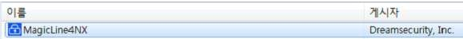

보고서 (REXPERT)

: Rexpert30 Print Service 1,0,0,24 - 06

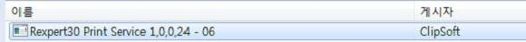

파일전송 (KUPLOAD)

: RAON K 2018

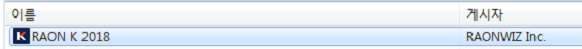

전자서명 (MAGIC-XML)

: NTSMagicXMLSecurityNP

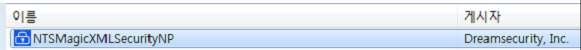

부정접속차단 (IPINSIDE)

: IPinside LWS Agent

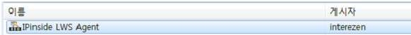

증명서위변조방지 (E-SAFER)

: MarkAny Inc. e-PageSafer v2.5 NTS NOAX Rex

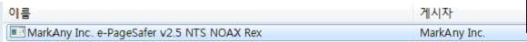