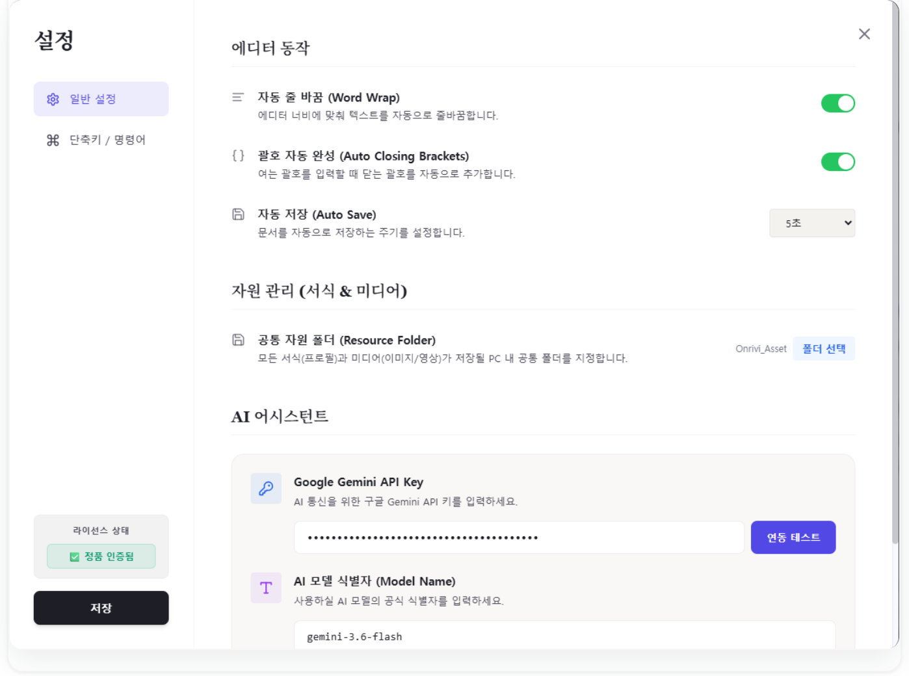
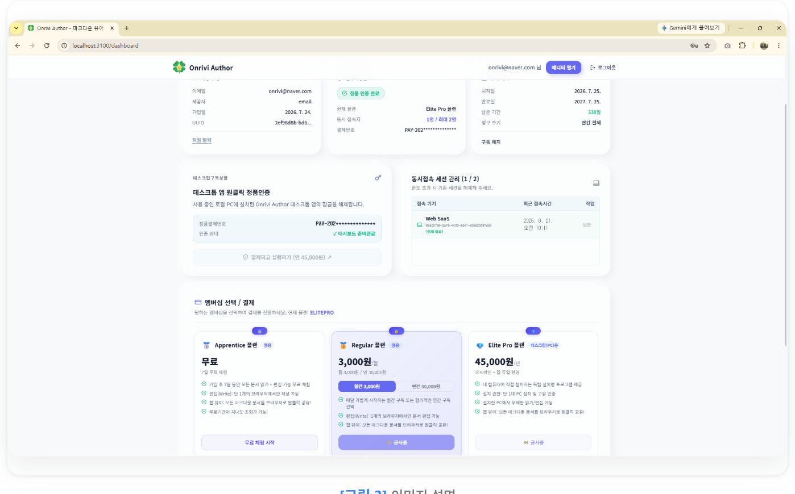
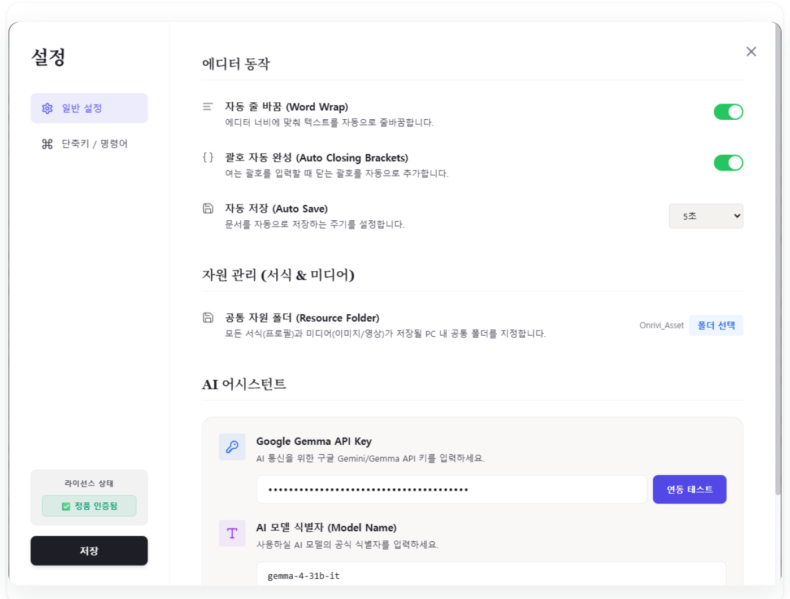
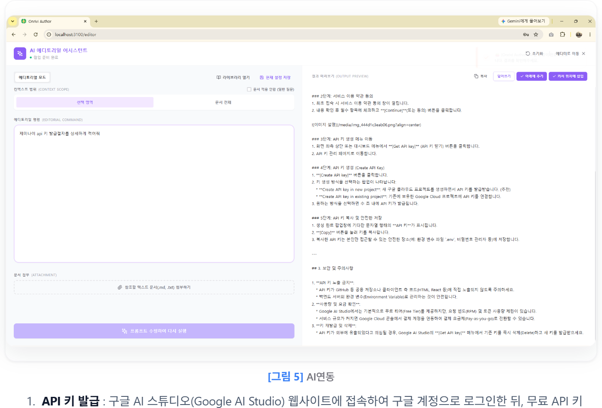
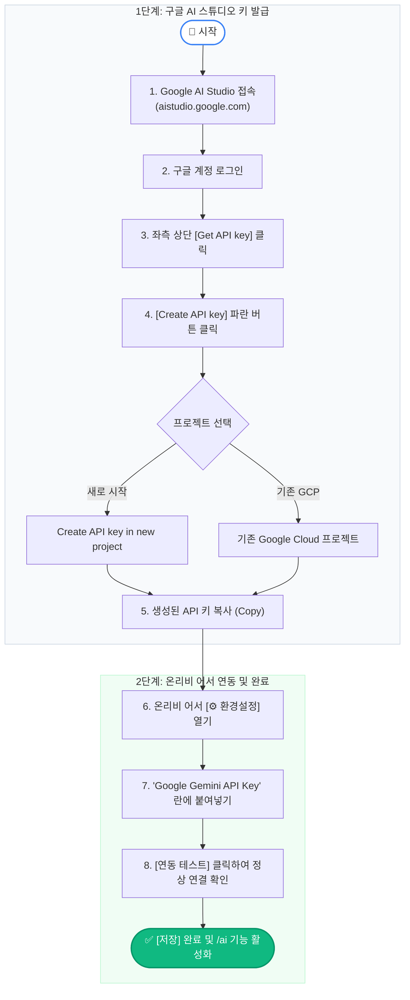
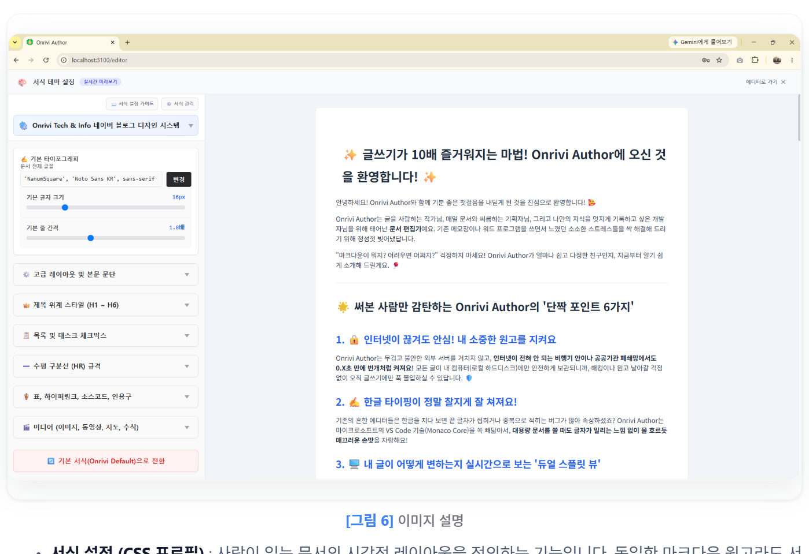

# 📋 네이버 블로그 포스팅용 최종 원고 (복사용)

[제목]

```text
2026년 온리비 어서(Onrivi Author) 환경설정 완벽 가이드 | 초기 세팅 4단계·공통 자원 폴더·Gemini AI 연동 꿀팁
```

[본문]

새로운 마크다운 문서 편집기를 시작할 때, 복잡한 설치 과정과 어려운 설정 때문에 시작부터 막막했던 경험이 있으신가요?

온리비 어서(Onrivi Author)는 무거운 프로그램 설치 없이 웹 접속과 간편 가입만으로 즉시 구동되며, 내 PC의 공통 자원 폴더 지정과 Google Gemini AI 연동을 통해 단 3분 만에 나만의 완벽한 로컬 보안 저작 환경을 구축할 수 있는 차세대 마크다운 에디터입니다.

처음 온리비 어서를 접하시는 분들을 위해 **A부터 Z까지 가장 이상적인 초기 세팅 4단계 순서와 핵심 꿀팁, 그리고 FAQ**까지 상세히 정리해 드립니다.

---

## 1. 온리비 어서 환경설정은 왜 중요하고 어떻게 시작하나

웹 가입부터 공통 자원 폴더 지정, Gemini AI 연동까지 4단계 기본 설정만 완료하면 평생 안전하고 쾌적한 나만의 집필 작업실이 완성됩니다.

온리비 어서는 일반적인 클라우드 기반 메모장과 달리, 사용자의 지식 자산과 문서를 안전하게 보호하는 **로컬 우선(Local-first) 아키텍처**를 채택하고 있습니다. 따라서 에디터를 실행한 후 본격적인 글쓰기에 들어가기 전에 몇 가지 핵심 환경설정을 진행해 두면, 작성 중인 모든 문서와 이미지 자원이 내 컴퓨터 안에서 안전하게 보관되며 AI의 강력한 보조까지 원스톱으로 누릴 수 있습니다.

- **준비물** : 인터넷 브라우저 (Chrome, Edge 등), 구글 계정 (Gemini API 키 발급용)
- **핵심 슬로건** : "가입 ➡️ 무료 요금제 선택 ➡️ 공통 자원 폴더 지정 ➡️ AI 키 등록"

---

## 2. 한눈에 보는 온리비 어서 A to Z 초기 세팅 4단계 요약

복잡한 절차 없이 아래 4가지 단계만 순서대로 완료하시면 모든 기본 준비가 끝납니다.


*[그림 1] 환경설정단계*

| 세팅 단계 | 주요 작업 내용 | 필수 / 권장 | 핵심 목적 및 이점 |
| :--- | :--- | :---: | :--- |
| **1단계: 웹 접속 & 계정 생성** | 공식 사이트(onrivi.com) 접속 후 간편 가입 | **[필수]** | 에디터 사용 권한 및 라이선스 활성화 |
| **2단계: 요금제 선택** | 대시보드에서 '무료(Apprentice) 요금제' 시작 | **[권장]** | 비용 부담 없이 온리비 어서의 전 기능 체험 |
| **3단계: 공통 자원 폴더 지정** | ⚙️ 환경설정에서 내 PC 로컬 폴더 선택 | **[가장 중요 / 필수]** | 이미지·영상·출판 서식의 100% 로컬 보안 보관 |
| **4단계: Gemini AI 연동** | Google AI Studio 무료 API 키 등록 | **[권장]** | 에디터 내 `/ai` 원클릭 지능형 초안 작성 활성화 |

---

## 3. [상세 튜토리얼] 온리비 어서 4단계 완벽 세팅법

실제 화면을 보며 차근차근 따라 하실 수 있는 단계별 실전 가이드입니다.


*[그림 2] 온리비 어서 환경설정 모달*

### 1단계: 웹 접속 및 계정 생성 🌐

에디터를 사용하기 위한 권한과 라이선스를 확보하는 첫걸음입니다.

- 인터넷 브라우저를 열고 온리비 공식 홈페이지에 접속합니다.
- 화면 우측 상단의 메뉴를 통해 간편 회원가입을 진행하고 로그인을 완료합니다. 별도의 무거운 프로그램을 PC에 다운로드하거나 설치할 필요가 없습니다.

### 2단계: 요금제 선택 (대시보드) 💳

나의 사용 목적에 맞는 라이선스를 활성화하는 단계입니다.


*[그림 3] 대시보드 요금제 선택 화면*

- 로그인 후 이동하는 대시보드 화면에서 요금제를 선택합니다. 요금제를 선택하지 않으면 무조건 Reader로 읽기 기능만 가능합니다. 무료/유료가 되어야 에디트 기능을 사용할 수 있습니다.
- **초보자 추천 팁** : 처음 시작하시는 분들은 우선 '무료(Apprentice) 요금제'를 선택하여 온리비 어서의 A4 실시간 프리뷰와 타이핑 손맛을 충분히 경험해 보신 뒤, 필요에 따라 유료 플랜으로 전환하시는 것을 권장합니다.

### 3단계: [가장 중요] 환경설정 - 공통 자원 폴더(Resource Folder) 지정 📂

에디터 실행 후 본격적인 글쓰기에 앞서 **반드시 가장 먼저 세팅해야 하는 핵심 항목**입니다.


*[그림 4] 환경파일-리소스폴더설정*

- 에디터 우측 하단의 **톱니바퀴(⚙️) 아이콘**을 클릭하여 환경설정 모달 창을 엽니다.
- **'공통 자원 폴더'** 항목에서 내 PC의 특정 폴더(예: `C:\MyWorkspace` 또는 `문서\Onrivi_Docs`)를 지정합니다.
- **왜 이 설정이 가장 중요한가요?** : 온리비 어서는 철저한 로컬 보안을 지향합니다. 이 폴더를 지정해 두면 문서에 삽입되는 모든 멀티미디어(이미지, 동영상 캡처) 자원과 사용자가 설정한 출판 서식(CSS 프로필)이 외부 서버로 업로드되지 않고, 오직 내 컴퓨터의 지정된 폴더 안에서 안전하고 통합적으로 관리됩니다.

### 4단계: 환경설정 - 인공지능(AI) 조수 연동 세팅 🤖

문서 작성 속도를 획기적으로 높여줄 AI 글쓰기 비서를 활성화하는 단계입니다.


*[그림 5] AI 연동*

1. **API 키 발급** : 구글 AI 스튜디오(Google AI Studio) 웹사이트에 접속하여 구글 계정으로 로그인한 뒤, 무료 API 키(Gemini API Key)를 발급받습니다.
2. **키 입력 및 모델 선택** : 온리비 어서 환경설정 창의 'Google Gemini API Key' 입력란에 복사한 키를 붙여넣고, 사용을 원하는 Gemini 모델을 선택합니다.
3. **연동 테스트 및 저장** : 입력창 옆의 **[연동 테스트]** 버튼을 눌러 초록색 정상 연결 메시지를 확인한 후, 설정 창 하단의 **[저장]**을 누르고 창을 닫습니다.

---

### [구글 제미나이 API 발급 절차]



---

## 4. 환경설정 완료 후 알아두면 좋은 추가 커스텀 꿀팁

기본 4단계 세팅을 마쳤다면, 이제 글을 쓰면서 천천히 나만의 맞춤형 에디터로 다듬어가실 수 있습니다.


*[그림 6] 서식 갤러리 및 디자인 시스템*

- **서식 설정 (CSS 프로필)** : 사람이 읽는 문서의 시각적 레이아웃을 정의하는 기능입니다. 동일한 마크다운 원고라도 서식 프로필에 따라 완전히 다른 출판물로 렌더링되며, 기업이나 단체의 공식 문서 표준 규격으로 일괄 통일할 수 있습니다.
- **플로팅 툴바 호출 (`Ctrl + Space`)** : 글을 쓰다가 문서의 태그나 서식을 빠르게 적용하고 싶을 때 마우스를 잡지 않고 `Ctrl + Space`를 누르면 커서 바로 옆에 서식 도구함이 나타납니다.
- **슬래시 명령어 (`/`)** : 빈 줄에서 `/`를 입력하면 제목(H1~H6), 표(Table), 체크리스트, `/ai` 등 다양한 명령어 목록이 펼쳐지며, 방향키로 선택하여 즉시 서식을 적용하고 실행할 수 있습니다.

---

## 5. 온리비 어서 환경설정 자주 묻는 질문 (FAQ)

**Q1. 공통 자원 폴더를 지정하지 않고 글을 쓰면 어떻게 되나요?**  
**A1.** 공통 자원 폴더를 지정하지 않으면 본문에 이미지를 첨부하거나 사용자 정의 서식 프로필을 불러올 때 경로를 찾지 못할 수 있습니다. 완벽한 로컬 자원 관리와 데이터 유실 방지를 위해 글을 쓰기 전 반드시 로컬 폴더를 먼저 지정해 주시는 것을 권장합니다.

**Q2. 구글 AI 스튜디오에서 Gemini API 키를 발급받는 것은 유료인가요?**  
**A2.** 아닙니다. Google AI Studio에서 제공하는 개인용 Gemini API 키는 기본 무료 티어 한도 내에서 완전 무료로 발급 및 이용이 가능합니다.

**Q3. 다른 PC에서 접속할 때도 4단계 설정을 매번 다시 해야 하나요?**  
**A3.** 계정 정보와 요금제는 웹 클라우드에 연동되므로 그대로 유지됩니다. 다만 다른 컴퓨터에서 접속하실 때는 해당 PC에 있는 로컬 폴더 경로만 환경설정(⚙️)에서 한 번 지정해 주시면 동일하게 작업하실 수 있습니다.

---

## 맺음말

온리비 어서의 초기 세팅은 **[가입 ➡️ 무료 요금제 선택 ➡️ 공통 자원 폴더 지정 ➡️ Gemini AI 키 등록]**의 4단계만 완료하시면 모든 준비가 끝납니다.

복잡한 설정 고민 없이 가볍게 시작하시고, 강력한 로컬 보안과 실시간 A4 출판 레이아웃이 주는 쾌적한 집필의 즐거움을 직접 경험해 보시기 바랍니다.

---

[네이버 블로그 태그 입력란에 복사할 해시태그]

```text
온리비어서, OnriviAuthor, 온리비어서환경설정, 마크다운에디터, 온리비어서사용법, GeminiAI연동, 로컬문서보안, 마크다운편집기, 문서편집기추천, 생산성도구
```
