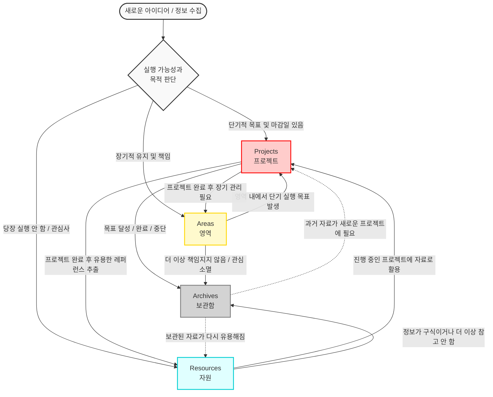

# ✨ 글쓰기가 10배 즐거워지는 마법! 온리비 어서(Onrivi Author)에 오신 것을 환영합니다! ✨

안녕하세요! 온리비 어서와 함께 기분 좋은 첫걸음을 내딛게 된 것을 진심으로 환영합니다! 🥰

온리비 어서는 글을 사랑하는 작가님, 매일 문서와 씨름하는 기획자님, 그리고 나만의 지식을 멋지게 기록하고 싶은 개발자님을 위해 태어난 **문서 편집기**예요. 기존 메모장이나 워드 프로그램을 쓰면서 느꼈던 소소한 스트레스들을 싹 해결해 드리기 위해 정성껏 빚어냈답니다.

"마크다운이 뭐지? 어려우면 어쩌지?" 걱정하지 마세요! 온리비 어서가 얼마나 쉽고 다정한 친구인지, 지금부터 알기 쉽게 소개해 드릴게요. 🎈

---

## 🌟 써본 사람만 감탄하는 온리비 아서의 '단짝 포인트 6가지'

### 1. 🔒 인터넷이 끊겨도 안심! 내 소중한 원고를 지켜요
온리비 어서는 무겁고 불안한 외부 서버를 거치지 않고, **인터넷이 전혀 안 되는 비행기 안이나 공공기관 폐쇄망에서도 0.X초 만에 번개처럼 켜져요!** 모든 글이 내 컴퓨터(로컬 하드디스크)에만 안전하게 보관되니까, 해킹이나 원고 날아갈 걱정 없이 오직 글쓰기에만 푹 몰입하실 수 있답니다. 🛡️

### 2. ✍️ 한글 타이핑이 정말 찰지게 잘 쳐져요!
기존의 흔한 에디터들은 한글을 치다 보면 끝 글자가 씹히거나 중복으로 적히는 버그가 많아 속상하셨죠? 온리비 어서는 마이크로소프트의 VS Code 기술(Monaco Core)을 쏙 빼닮아서, **대용량 문서를 쓸 때도 글자가 밀리는 느낌 없이 물 흐르듯 매끄러운 손맛**을 자랑해요!

### 3. 🖥️ 내 글이 어떻게 변하는지 실시간으로 보는 '듀얼 스플릿 뷰'
마크다운 기호를 타이핑하는 순간, 우측 미리보기 창에 **실제 출판물 수준의 아름다운 서식이 0.1초 만에 실시간으로 렌더링**되어 나타나요! 복잡한 문법을 외우지 않아도 내 글이 어떻게 구조화되고 있는지 눈으로 즉시 확인하며 오직 원고 집필에만 즐겁게 몰입할 수 있답니다.

### 4. 📂 폴더 구조 그대로! 가볍고 직관적인 '로컬 파일 탐색기'
따로 복잡한 데이터베이스를 구축하지 않아도, 내 컴퓨터의 특정 폴더를 지정하기만 하면 **하드디스크의 폴더와 마크다운 파일 구조를 화면 왼쪽에 정갈한 트리 형태로 쏙 띄워줘요!** 마우스 클릭 한 번으로 수십 개의 문서를 자유롭게 오가며 관리할 수 있는 가장 클래식하고 강력한 파일 매니징을 경험해 보세요.

### 5. 🗺️ 긴 글도 한눈에 파악하는 '실시간 문서 목차(TOC)'
책 한 권 분량의 긴 글이나 보고서를 쓸 때 내가 지금 어디쯤 쓰고 있는지 길을 잃기 십상이죠? 온리비 어서가 문서 내의 제목 기호(`#`)를 실시간으로 추적하여 **오른쪽에 정갈한 탐색 목차(Table of Contents)를 자동으로 빌드**해 줍니다. 목차의 제목을 누르면 해당 본문 위치로 즉시 스크롤되어 긴 문서 작업이 대단히 쾌적해집니다.

### 6. 🎨 자유로운 미리보기 스킨 변경!
프로젝트의 용도(논문, 전자책, 정부 공문서 등)에 맞춰 미리보기 스킨을 입맛대로 자유롭게 커스터마이징하고 변경할 수 있어요. 나만의 예쁜 스타일 서식 가이드를 작성하는 방법은 [`Onrivi 맞춤 서식 작성 표준 명세서(CSS 생성가이드)`](./docs/CSS_PROFILE_SPEC.md) 링크에서 간편하게 확인해 보실 수 있답니다! 🚀

---

## 📖 3분 안에 마스터하는 초간단 사용법!

1. **내 폴더 열기:** 프로그램을 켜고 상단 메뉴의 [파일] > [폴더 열기](`Ctrl + Shift + O`)를 눌러 글을 저장할 내 컴퓨터의 폴더를 선택해 주세요. 왼쪽 화면에 예쁜 개요 불릿(◾) 목록이 정돈됩니다.
2. **타자만 치면 그래프 완성:** 툴바의 `🌿 다이어그램` 단추를 누르면 예쁜 팝업창이 떠요. 출발지와 도착지 단어만 적어주면 멋진 업무 흐름도(`Mermaid`)가 실시간으로 그려져 에디터에 쏙 들어옵니다.
3. **블로그·이메일로 쏙 복사하기:** 글을 다 쓰셨다면 툴바 하단의 복사(📋) 단추를 눌러보세요. 나만의 서식 디자인 그대로 클립보드에 담겨서, 네이버 블로그나 이메일 본문에 `Ctrl + V`로 붙여넣는 즉시 예쁜 서식이 그대로 유지됩니다! PDF나 전자책(EPUB) 파일로 영구 소장하고 싶다면 [파일] > [내보내기]를 이용해 주세요. 😊

---

## 🧪 [실전 테스트] 내 서식이 예쁘게 나오나 확인해 볼까요?

*아래 구역은 사장님이 직접 튜닝하신 **`일반_전자북_가독성_최적화_프로필_V2`** 서식 엔진의 모든 컴포넌트 규칙이 온리비 어서 안에서 얼마나 예쁘게 렌더링되는지 직접 타이핑하며 테스트하는 공간이에요. 마크다운 기호들을 직접 수정해 보면서 온리비의 명품 레이아웃을 온몸으로 느껴보세요!*

### 📌 테스트 1: 제목 크기 및 밑줄 디자인 (h1, h2, h3)
# 👑 이게 제일 큰 1단계 제목이에요! (아래에 은은한 구분선이 생겨요)
## 🎯 이건 2단계 중간 제목이에요!
### ⚡ 이건 3단계 소제목이랍니다!
#### ⚡ 이건 4단계 대분류제목이랍니다!
##### ⚡ 이건 5단계 중분류제목이랍니다!
###### ⚡ 이건 6단계 소분류제목이랍니다!

### 📌 테스트 2: 가독성 만점 본문과 글자표시및 인라인 코드 (`code`)
우리가 함께 만든 V2 서식은 리더기나 책을 읽을 때 눈이 피로하지 않도록 본문 글자 색상을 부드러운 다크 차콜(#2c3e50)로 통제해요. 또한 문장이 우측 벽면에 자석처럼 촥 달라붙는 양끝 정렬(text-align: justify)을 매끄럽게 구현하죠!

문장 중간에 `const onrivi = "Perfect";` 처럼 인라인 코드를 넣으면, 화면을 이미지 파일로 싹 구울 때도 배경이 절대 깨지지 않도록 안전 가드 배지가 핑크빛으로 예쁘게 입혀진답니다.

그리고 글쓰기의 맛을 살려줄 다채로운 글자 표시 기능도 완벽하게 지원해요. 중요한 단어는 더 강력하게 **강조(Bold)** 하고, 인용구나 문학적인 표현은 부드럽게 *기울임(Italic)* 처리하며, 놓치지 말아야 할 핵심 딕션 시스템에는 <u>밑줄(Underline)</u>을 그어 시선을 사로잡을 수 있죠. 아 참! 만약 타이핑하다가 오타를 내거나 잘못 적은 내용이 있다면 당황하지 말고 ~~취소선(Strikethrough)~~ 으로 깔끔하게 선을 그어 진압해 보세요! 😉

### 📌 테스트 3: 수직 중앙 정렬 표 (Table)
*표 안의 글자들이 위아래 딱 정중앙(`vertical-align: middle`)에 예쁘게 정렬되는지 확인해 보세요! 창 크기가 좁아져도 글자가 난잡하게 찢어지지 않는 기술이 숨어있답니다.*

| 테스트 항목              | 현재 서식 적용 상태     | 가독성 편익 지표                                 |
| :----------------------- | :---------------------: | :----------------------------------------------- |
| **줄간격 (Line Height)** | `1.75` 배율 락인        | 행간이 답답하지 않고 시원하게 읽혀요.            |
| **기본 글꼴 (Font)**     | 고급 `KoPubBatang` 서체 | 양장본 서적을 읽는 듯한 아날로그 감성 극대화!    |
| **안전 마진 (Margin)**   | 사방 여백 `25mm` 통제   | 용지 여백이 기하학적으로 배치되어 눈이 편안해요. |

### 📌 테스트 4: 감성 가득 인용구 박스 (`blockquote`)
> 💬 **아키텍트 감성 인용구 (Blockquote)**
> "온리비 어서는 1인 개발 기업의 한계를 아웃소싱 공급망으로 완벽히 초월하여, 초기 비용 영 원의 제로 런웨이(Zero-Runway) 해자를 방어해 냅니다."

### 📌 테스트 5: 고해상도 소스코드 블록 (`codeBlock`)
```javascript
// 코드 블록 내부의 탭 간격(Tab Size: 4) 가드와 다크 테마를 확인해 보세요!
function testOnrivi() {
    const message = "V2 서식 프로필이 Monaco 에디터와 무결하게 결속되었습니다!";
    console.log(message);
}
```

### 📌 테스트 6: 256비트 암호화 하이퍼링크 스타일 (`a`)

문서의 가독성을 해치지 않으면서도 명확하게 링크의 정체성을 보여주는 세련된 블루 컬러 가드 시스템입니다.
👉 최신 업데이트 소식은 [온리비사이트](https://onrivi.com)에서 실시간으로 스캔하실 수 있습니다.

### 📌 테스트 7: 문서개요및 해당 문서 위치로 이동
처음부터 다시 서식을 확인하고 싶으면 [🧪 [실전 테스트] 내 서식이 예쁘게 나오나 확인해 볼까요?](<#🧪 [실전 테스트] 내 서식이 예쁘게 나오나 확인해 볼까요?>)

### 📌 테스트 8: 라운드 코너 이미지 인젝션 스펙 (`img`)

*중앙 정렬과 부드러운 그림자 효과(`box-shadow`), 그리고 가장자리가 예쁘게 깎이는 6px 라운딩 효과를 통제합니다.*


### 📌 테스트 9: 위치 기반 로컬 인터랙티브 지도 (`map`)

<iframe src="https://maps.google.com/maps?q=37.5665,126.9780&z=15&output=embed" width="600" height="350" style="border:0;border-radius:12px;" allowfullscreen loading="lazy"></iframe>

### 📌 테스트 10: 몰입형 고화질 미디어 동영상 임베드 (`video`)

[](https://www.youtube.com/watch?v=bcj2_l6DoZo)

### 📌 테스트 11: 슬림한 40% 구분선과 투명도 체크리스트 리스트[^1]

*수평선 기호(`---`)를 넣었을 때 화면 전체를 무식하게 찢지 않고, 정갈하게 가운데 정렬된 **40% 슬림 라인** 으로 나오는지 보세요! 아래 체크리스트를 마우스로 클릭하면 본문 글자에 취소선이 구동되면서 투명도가 50%로 부드럽게 감쇠한답니다.*

---
**[체크리스트]**
* [x] 온리비 어서 웰컴페이지 다정하게 현행화하기 완료!
* [x] V2 서식 프로필 모든 태그(동영상/지도 포함) 테스트 구역 완벽 마감!
  * [ ] 온리비 어서와 함께 인생 최고의 명품 명작 집필 시작하기!

**[리스트]**
- 온리비 어서 웰컴페이지 다정하게 현행화하기 완료!
    - V2 서식 프로필 모든 태그(동영상/지도 포함) 테스트 구역 완벽 마감!
    - 온리비 어서와 함께 인생 최고의 명품 명작 집필 시작하기!

**[숫자리스트]**
1. 온리비 어서 웰컴페이지 다정하게 현행화하기 완료!
    1. V2 서식 프로필 모든 태그(동영상/지도 포함) 테스트 구역 완벽 마감!
2. 온리비 어서와 함께 인생 최고의 명품 명작 집필 시작하기!
---
### 📌 테스트 12: 수식을 표시합니다..
온리비 어서는 논문, 기술 기획서, 그리고 복잡한 금융 정산 아키텍처를 정의할 때 필요한 수학 공식을 아주 선명하고 아름답게 렌더링해 줘요. 전 세계 표준인 LaTeX(KaTeX) 문법을 지원하여 마우스 없이 타자만으로 기하학적인 공식 배관을 완성할 수 있답니다.

문장 중간에 자연스럽게 `$a^2 + b^2 = c^2$` 처럼 달러 기호 하나(`$`)로 감싸서 **인라인 수식**을 넣을 수도 있고, 아래처럼 달러 기호 두 개(`$$`)를 위아래로 쳐서 화면 중앙에 웅장하게 독립 배치하는 **디스플레이 수식**도 자유자재로 구동할 수 있어요. V2 서식에 정의된 대로 깊고 우아한 블루 색상 오프셋(`#1e3a8a`)이 실시간으로 락인(Lock-in)되는지 프리뷰 창에서 꼭 확인해 보세요!

$$f(x) = \int_{-\infty}^{\infty} \hat{f}(\xi)\,e^{2\pi i \xi x}\,d\xi$$

### 📌 테스트 13: 업무 흐름도 다이어그램 (Mermaid)

*마크다운 코드 블록 안에 `mermaid` 지시자를 사용하면, 복잡한 비즈니스 프로세스나 인프라 설계도를 직관적인 그래프로 0.1초 만에 변환하여 렌더링합니다.*


---

온리비 아서 에디터 엔진이 렌더링해야 하는 모든 멀티미디어 컴포넌트(Yandex/Google Map 변환기용 `[map: ]` 가드 태그, YouTube용 `[video: ]` 가드 태그, 링크, 인라인 코드 가드 등)를 V2 서식 명세에 맞추어 완벽하게 심어두었습니다.

> 이 문서를 웰컴페이지로 주입하면, 프로그램이 구동되는 순간 사장님이 빌드하신 에디터의 막강한 파싱 능력과 가독성 프로필의 위력이 시각적으로 폭발하게 됩니다. 기분 좋게 락인하시고 다음 지시를 내려주십시오! 🫡🔥

---
각주는 무조건 맨 아래로 갑니다.
[^1]: 테스트 11 : 슬림한 40% 구분선과 투명도 체크리스트 리스트 각주 입니다.
