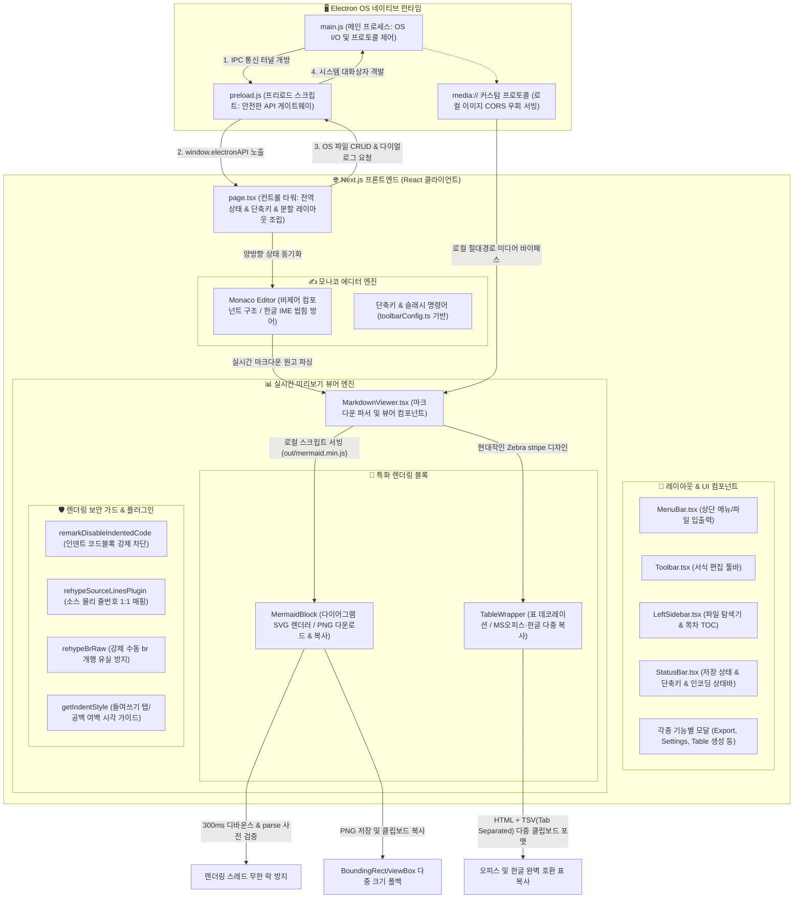

# 10. 온리비 어서(Onrivi Author) 시스템 아키텍처 및 기능 명세서

이 문서는 온리비 어서 에디터의 네이티브(Electron) 연동 구조, 프론트엔드 컴포넌트 아키텍처, 그리고 핵심 파싱 시각화 모듈의 설계 구성과 기능 명세를 정리한 명세서입니다.

---

## 📊 1. 시스템 기능 아키텍처 다이어그램

---

## 📋 2. 주요 레이어별 핵심 기능 명세

### ① 🖥️ OS 네이티브 파일 I/O 및 브릿지 레이어 (`main.js`, `preload.js`)
- **OS 파일 시스템 연동**: 일렉트론 IPC 통신을 통해 로컬 드라이브를 탐색하고, 파일/폴더의 CRUD(생성, 읽기, 수정, 삭제, 이름 변경) 및 파일 다이얼로그(Dialog) 연동을 매끄럽게 처리합니다.
- **미디어 CORS 우회 프록시 (`media://`)**: 로컬 절대경로 미디어(이미지, 동영상 등)를 브라우저에 바로 그릴 때 생기는 오리진 제약을 우회하기 위해 메인 프로세스가 fetch를 가로채 프록시 서빙해 줍니다.
- **오프라인 렌더링 지원**: 네트워크 연결이 없는 환경에서도 다이어그램이 켜지도록 `mermaid.min.js` 등 대형 외부 라이브러리를 로컬에 내장하여 서빙하는 정적 배포 구조를 구현했습니다.

### ② ✍️ 에디터 코어 레이어 (`Monaco Editor`, `page.tsx`)
- **한글 IME composition 방어**: 모나코 에디터 입력 상태 변경 시 React 상태와의 실시간 양방향 꼬임을 막기 위해 디바운스 바인딩을 적용하여, 한글 입력기가 먹통이 되거나 글자가 중복 입력되는 고질적인 버그를 완전 진압했습니다.
- **소스 물리 줄번호 1:1 매핑**: 양방향 스크롤 연동 시 파싱된 돔 노드에 원래 소스의 줄번호(`data-line`)를 정밀 매핑하여, 에디터와 미리보기 창 간 싱글 스크롤 위치가 흔들리지 않도록 동기화합니다.

### ③ 📊 미리보기 시각화 레이어 (`MarkdownViewer.tsx`)
- **Mermaid 다이어그램 안전 가드**:
  - **300ms 디바운스 가드**: 빠른 타자 중 계속 컴파일되지 않도록 입력이 잠시 멈춘 뒤 렌더링되게 설계하여 렌더링 스레드 락을 원천 차단했습니다.
  - **parse 사전 검증 가드**: `mermaid.parse(code)`를 통해 사전에 문법의 무결성이 검증된 정품 코드일 때만 컴파일을 개시하며, 미완성 시 임시 안내 문구를 노출하여 화면 뻗음 현상을 완벽 방어합니다.
  - **다중 크기 폴백**: 다이어그램 PNG 내보내기/복사 시 SVG의 기하학적 크기를 다각도로 계산(`getBoundingClientRect`, `viewBox`, `width/height`)해 크래시를 방지합니다.
- **표(Table) 복사 고도화**:
  - 표 스타일을 현대적인 보더와 얼룩무늬 행 배경 및 호버 하이라이트로 디자인했습니다.
  - 표 위에 마우스를 호버하면 나타나는 복사 단추를 클릭할 때 HTML 데이터와 엑셀 친화적인 TSV(탭 구분 텍스트)를 **다중 클립보드 포맷**으로 동시에 적재하여, 워드·한글·엑셀 프로그램에 표 형식을 그대로 온전히 보존하며 복사할 수 있습니다.
