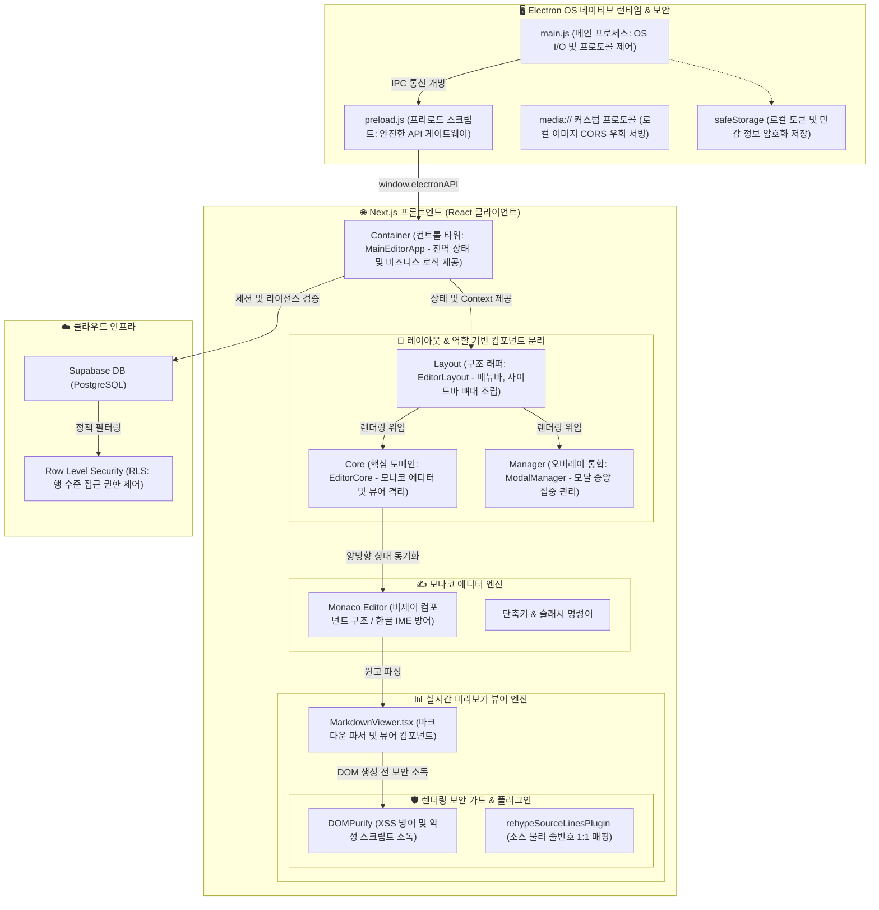

# 10. 온리비 어서(Onrivi Author) 시스템 아키텍처 및 기능 명세서

이 문서는 온리비 어서 에디터의 네이티브(Electron) 연동 구조, 프론트엔드 컴포넌트 아키텍처, 그리고 핵심 파싱 시각화 모듈의 설계 구성과 기능 명세를 정리한 명세서입니다.

---

## 📊 1. 시스템 기능 아키텍처 다이어그램

```mermaid
graph TD
  subgraph Electron_OS ["🖥️ Electron OS 네이티브 런타임 & 보안"]
    Main["main.js (메인 프로세스: OS I/O 및 프로토콜 제어)"]
    Preload["preload.js (프리로드 스크립트: 안전한 API 게이트웨이)"]
    MediaProto["media:// 커스텀 프로토콜 (로컬 이미지 CORS 우회 서빙)"]
    SafeStorage["safeStorage (로컬 토큰 및 민감 정보 암호화 저장)"]
  end

  subgraph Nextjs_App ["🌐 Next.js 프론트엔드 (React 클라이언트)"]
    Container["Container (컨트롤 타워: MainEditorApp - 전역 상태 및 비즈니스 로직 제공)"]
    
    subgraph UI_Components ["🎨 레이아웃 & 역할 기반 컴포넌트 분리"]
      Layout["Layout (구조 래퍼: EditorLayout - 메뉴바, 사이드바 뼈대 조립)"]
      Core["Core (핵심 도메인: EditorCore - 모나코 에디터 및 뷰어 격리)"]
      Manager["Manager (오버레이 통합: ModalManager - 모달 중앙 집중 관리)"]
    end

    subgraph Editor_Engine ["✍️ 모나코 에디터 엔진"]
      Monaco["Monaco Editor (비제어 컴포넌트 구조 / 한글 IME 방어)"]
      Hotkeys["단축키 & 슬래시 명령어"]
    end

    subgraph Preview_Engine ["📊 실시간 미리보기 뷰어 엔진"]
      Viewer["MarkdownViewer.tsx (마크다운 파서 및 뷰어 컴포넌트)"]
      
      subgraph Security_Layer ["🛡️ 렌더링 보안 가드 & 플러그인"]
        DOMPurify["DOMPurify (XSS 방어 및 악성 스크립트 소독)"]
        RehypeLines["rehypeSourceLinesPlugin (소스 물리 줄번호 1:1 매핑)"]
      end
    end
  end

  subgraph Database ["☁️ 클라우드 인프라"]
    Supabase["Supabase DB (PostgreSQL)"]
    RLS["Row Level Security (RLS: 행 수준 접근 권한 제어)"]
  end

  %% 상호작용 및 데이터 흐름
  Main -- "IPC 통신 개방" --> Preload
  Preload -- "window.electronAPI" --> Container
  Main -.-> SafeStorage
  
  Container -- "상태 및 Context 제공" --> Layout
  Layout -- "렌더링 위임" --> Core
  Layout -- "렌더링 위임" --> Manager

  Core -- "양방향 상태 동기화" --> Monaco
  Monaco -- "원고 파싱" --> Viewer
  Viewer -- "DOM 생성 전 보안 소독" --> DOMPurify
  
  Container -- "세션 및 라이선스 검증" --> Supabase
  Supabase -- "정책 필터링" --> RLS
```

---

## 📋 2. 주요 레이어별 핵심 기능 명세

### ① 🖥️ OS 네이티브 파일 I/O 및 브릿지 레이어 (`main.js`, `preload.js`)
- **OS 파일 시스템 연동**: 일렉트론 IPC 통신을 통해 로컬 드라이브를 탐색하고, 파일/폴더의 CRUD(생성, 읽기, 수정, 삭제, 이름 변경) 및 파일 다이얼로그(Dialog) 연동을 매끄럽게 처리합니다.
- **미디어 CORS 우회 프록시 (`media://`)**: 로컬 절대경로 미디어(이미지, 동영상 등)를 브라우저에 바로 그릴 때 생기는 오리진 제약을 우회하기 위해 메인 프로세스가 fetch를 가로채 프록시 서빙해 줍니다.
- **오프라인 렌더링 지원**: 네트워크 연결이 없는 환경에서도 다이어그램이 켜지도록 `mermaid.min.js` 등 대형 외부 라이브러리를 로컬에 내장하여 서빙하는 정적 배포 구조를 구현했습니다.

### ② ✍️ 에디터 코어 레이어 (`Monaco Editor`, `page.tsx`)
- **한글 IME composition 방어**: 모나코 에디터 입력 상태 변경 시 React 상태와의 실시간 양방향 꼬임을 막기 위해 디바운스 바인딩을 적용하여, 한글 입력기가 먹통이 되거나 글자가 중복 입력되는 고질적인 버그를 완전 진압했습니다.
- **소스 물리 줄번호 1:1 매핑**: 양방향 스크롤 연동 시 파싱된 돔 노드에 원래 소스의 줄번호(`data-line`)를 정밀 매핑하여, 에디터와 미리보기 창 간 싱글 스크롤 위치가 흔들리지 않도록 동기화합니다.

### ③ 📊 미리보기 시각화 레이어 (`MarkdownViewer.tsx`)
- **Mermaid 다이어그램 안전 가드**:
  - **300ms 디바운스 가드**: 빠른 타자 중 계속 컴파일되지 않도록 입력이 잠시 멈춘 뒤 렌더링되게 설계하여 렌더링 스레드 락을 원천 차단했습니다.
  - **parse 사전 검증 가드**: `mermaid.parse(code)`를 통해 사전에 문법의 무결성이 검증된 정품 코드일 때만 컴파일을 개시하며, 미완성 시 임시 안내 문구를 노출하여 화면 뻗음 현상을 완벽 방어합니다.
  - **다중 크기 폴백**: 다이어그램 PNG 내보내기/복사 시 SVG의 기하학적 크기를 다각도로 계산(`getBoundingClientRect`, `viewBox`, `width/height`)해 크래시를 방지합니다.
- **표(Table) 복사 고도화**:
  - 표 스타일을 현대적인 보더와 얼룩무늬 행 배경 및 호버 하이라이트로 디자인했습니다.
  - 표 위에 마우스를 호버하면 나타나는 복사 단추를 클릭할 때 HTML 데이터와 엑셀 친화적인 TSV(탭 구분 텍스트)를 **다중 클립보드 포맷**으로 동시에 적재하여, 워드·한글·엑셀 프로그램에 표 형식을 그대로 온전히 보존하며 복사할 수 있습니다.

### ④ 🧩 프론트엔드 UI 아키텍처 역할 분리 (Container-Layout-Core)
비대해진 대형 화면 컴포넌트의 복잡도를 낮추기 위해 **역할(Role)**을 명확히 구분하여 설계했습니다.
- **Container (컨트롤 타워)**: `MainEditorApp` 컴포넌트는 화면을 직접 그리지 않고 오직 상태(State), 비즈니스 로직, Context Provider 제공에만 집중합니다.
- **Layout (구조 래퍼)**: `EditorLayout` 컴포넌트는 앱의 상하좌우 뼈대, 메뉴바, 사이드바 등 고정적인 껍데기 UI 골격을 배치합니다.
- **Core (핵심 도메인 뷰)**: `EditorCore` 컴포넌트는 서비스 본질의 가치가 집중되는 핵심 렌더링 영역(모나코 에디터 및 뷰어)을 격리하여 관리합니다.
- **Manager (오버레이 통합 관리)**: `ModalManager` 등은 모달(Modal)이나 플러그인 등 독립적인 Z-Index와 생명주기를 가지는 플로팅 UI들을 중앙 집중식으로 묶어 관리합니다.

### ⑤ 🔐 보안 및 데이터 무결성 
- **DOMPurify 기반 XSS 원천 차단**: 마크다운이 HTML로 변환되는 과정에서 발생할 수 있는 교차 사이트 스크립팅(XSS) 공격을 방지하기 위해, 전 세계 표준 소독 라이브러리인 DOMPurify를 렌더링 파이프라인에 통합했습니다. 악의적인 스크립트 태그나 이벤트 핸들러가 돔 트리 생성 이전에 완전히 제거됩니다.
- **콘텐츠 보안 정책(CSP) 가드**: 렌더링 레이어 외곽에서도 한 번 더 CSP 헤더를 엄격히 제한하여 인라인 스크립트 실행과 외부 무단 자원 로딩을 이중으로 통제합니다.
- **Supabase RLS (Row Level Security)**: 클라우드 데이터베이스 연동 시, 각 클라이언트 사용자는 오직 본인의 구독(Subscription) 및 세션(Session) 데이터에만 접근할 수 있도록 테이블 행 수준의 강력한 보안 정책(RLS)을 적용하여 데이터 누출 및 무결성 훼손을 차단합니다.
